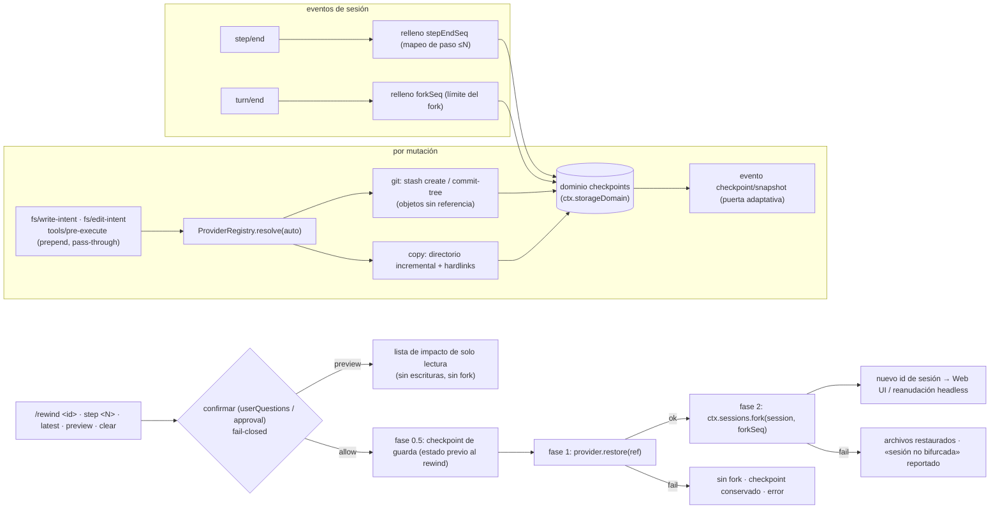

# dsh-checkpoint-rewind

[English](README.md) · [中文](README.zh.md) · **Español** · [Português](README.pt.md) · [हिन्दी](README.hi.md)

**`/rewind` de Claude Code, bien hecho para DeepSeek Harness.**

Un plugin de capability-seam que añade **instantáneas de archivos del workspace + retroceso por límite de sesión** a [DeepSeek Harness](https://github.com/deepseek-ai/deepseek-harness): antes de cada herramienta que muta, el plugin captura el workspace (git primero, copia como respaldo) y un único comando `/rewind` restaura los archivos **y** bifurca (fork) la sesión hasta el límite de turno del checkpoint — así el contexto del modelo y los archivos en disco siempre coinciden.

[](LICENSE)
[](https://www.npmjs.com/package/dsh-checkpoint-rewind)
[](https://www.npmjs.com/package/dsh-checkpoint-rewind)
[](https://github.com/PerryLink/dsh-checkpoint-rewind/actions/workflows/ci.yml)
[](#)
[](#)

> **Topics**: `dsh` · `dsh-plugin` · `deepseek-harness` · `rewind` · `checkpoint` · `snapshot` · `session-fork` · `workspace-safety` · `undo` · `cordis-plugin`

**TL;DR**

- 📸 **Instantánea antes de cada mutación** — todos los caminos de escritura (`write`, `edit`, `str_replace_editor`, `bash`, `pwsh`, `terminal_send`, …) se capturan primero, en silencio, vía listeners pass-through `fs/*-intent` + `tools/pre-execute`.
- 🧵 **git primero, sin riesgo histórico** — las instantáneas son objetos git sin referencia (`stash create` / `commit-tree`); la restauración es solo-worktree y por rutas explícitas, así que los archivos creados después del checkpoint **nunca se borran**. Los directorios sin git degradan a instantáneas incrementales de directorio.
- ⏪ **Un comando para volver** — `/rewind` lista checkpoints; `/rewind <id-prefijo>` / `step <N>` / `latest` confirma, restaura archivos, luego bifurca la sesión en el límite de turno del checkpoint y devuelve el id de la nueva sesión.
- 🔍 **Previsualiza antes de saltar** — `/rewind preview <target>` imprime el impacto exacto (archivos que se sobrescribirían, archivos creados después del checkpoint que permanecen) sin tocar nada — sin prompt de confirmación, sin escrituras, sin fork.
- 🛡️ **El rewind es reversible** — primero se captura un checkpoint de guarda del estado previo al rewind, de modo que `/rewind <guard-id>` deshace el rewind.
- 🔒 **Fail-closed por diseño** — restaurar requiere confirmación humana; sin respondedor no hay restauración. Nada de `git reset --hard`, nada de `git clean`, nunca edición de mensajes, nunca escrituras a través de enlaces simbólicos.

---

## ¿Por qué otro plugin de rewind?

| Plugin | Qué vende | ¿Restaura archivos? | ¿Retrocede la sesión? |
|---|---|---|---|
| **dsh-checkpoint-rewind** (este) | instantáneas con objetos git + fork por turno + restauración de un paso | ✅ estado completo del workspace | ✅ sesión hija con fork |
| [Anionex/dsh-turn-rewind](https://github.com/Anionex/dsh-turn-rewind) | Change Ledger persistente de deltas por mutación | ✅ repitiendo deltas inversos | ✅ su propio modelo de ledger |
| [LingLambda/dsh-undo](https://github.com/LingLambda/dsh-undo) | retroceso solo de contexto al último paso completado | ❌ | ✅ solo contexto |
| [Mongfayi/dsh-recall](https://github.com/Mongfayi/dsh-recall) | retirada de mensajes (borra el turno y lo posterior) | ❌ (explícitamente) | ✅ borrado de turno |

La diferencia en una frase: **dsh-checkpoint-rewind captura el *estado del workspace* con primitivas git sin efectos secundarios antes de cada mutación y convierte «volver al paso N» en un comando aprobado — primero el checkpoint de guarda, segundo los archivos restaurados, tercero la sesión bifurcada, cada fase registrada.** Sin libro de deltas que se desincronice, sin edición de mensajes (eso es otro plugin), sin sincronización entre dispositivos.

## Características

- **Instantáneas antes de cada mutación** — escucha pass-through con `prepend` en `fs/write-intent` / `fs/edit-intent` más `tools/pre-execute` para mutadores no-fs (`bash`, `pwsh`, `terminal_send`, …), cubriendo *todos* los caminos de cambio sin robar el slot de decisión de la política.
- **Provider seam** — `git` primero: `git stash create` / `git commit-tree` producen objetos de instantánea sin referencia que **jamás tocan worktree, índice o historial**; la restauración es solo-worktree y restaura **solo rutas explícitas** — `git restore … -- .` borraría archivos con `git add` posteriores al checkpoint, por lo que el provider nunca lo emite. Los repositorios con HEAD no nacido (unborn) se detectan y degradan a `copy`; las sondas de disponibilidad se cachean por workspace. Los directorios sin git usan `copy` (instantáneas incrementales de directorio con reutilización de hardlinks), claramente etiquetados en la lista.
- **Mapeo por paso, forks por turno** — cada checkpoint registra su turno/paso; `step/end` rellena el mapeo de pasos («volver al paso N» = instantánea más cercana ≤ N, accesible vía `/rewind step <N>`) y `turn/end` rellena el límite del fork, usando el primitivo real `ctx.sessions.fork` del harness.
- **Transacción de rewind en tres fases** — `/rewind <id>` pide confirmación (seam userQuestions / approval, **fail-closed sin respondedor**), captura un **checkpoint de guarda** del estado actual (config `preRewindCheckpoint`), restaura archivos en segundo lugar, luego bifurca en tercero; un fallo de restauración nunca bifurca, un fallo de fork informa «archivos restaurados, sesión no bifurcada» — y el checkpoint de guarda hace que todo el rewind sea deshacible.
- **Previsualización de impacto de solo lectura** — `/rewind preview <target>` (mismo direccionamiento: prefijo de id, `step <N>`, `latest`) muestra exactamente qué archivos sobrescribiría una restauración y qué archivos posteriores al checkpoint permanecerían, sin la puerta de confirmación, sin escrituras y sin fork — aprobación informada en lugar de un salto de fe.
- **Registro durable + cuotas** — los registros viven en `ctx.storageDomain` (dominio `checkpoints`; backend SQLite = filas, backend JSON = archivo legible); `maxSnapshots` (por sesión, 50 por defecto) y `maxSnapshotBytes` (cuota blanda global **de bytes incrementales**, 512 MiB por defecto; el checkpoint más nuevo por sesión siempre se conserva, de modo que los workspaces grandes nunca se auto-podan), `pruneOnTurnEnd`, primero-lo-más-antiguo.
- **Opción de integridad del copy** — `verifyByHash` hace que el provider copy compare hashes de contenido en lugar de size+mtime (un `touch -r`/`rsync -t` con mtime exacto no puede ocultar un cambio de contenido del mismo tamaño) y verifique el contenido restaurado; los modos de archivo se restauran en la medida de lo posible.
- **Reconstruible por diseño** — la salida de `/rewind` viaja en los eventos propios del harness `command/run` + `command/done`; los eventos de sesión `checkpoint/snapshot|bound|prune|rewind` se añaden cuando el host conoce los tipos **o** soporta el sobre (envelope) `ignorable` (sonda en runtime; la puerta adaptativa rc.6 permanece cerrada y segura).
- **Proyección lista para la Web** — una unidad de proyección de sesión `checkpoints` se registra siempre que exista `ctx.sessionProjections` (vía `ctx.inject`), de modo que un panel del shell puede renderizar la franja de checkpoints desde el log de eventos sin cambios en el plugin.
- **Rewind consciente del modelo** — la sesión hija bifurcada recibe un aviso inyectado (`user/message`, fuente plugin) que nombra el checkpoint, la restauración y el checkpoint de guarda, para que el modelo reanudado no continúe con resultados de herramientas obsoletos.

## Compatibilidad

| Requisito | Estado | Última verificación |
|---|---|---|
| DeepSeek Harness `0.1.0-rc.6` (npm `next`) | ✅ nivel de carga verificado | 2026-08-14 (instalación vía tarball → `dsh --profile headless --dump-config` muestra la capa; la ejecución headless solo llega a la etapa de credenciales) |
| Node `^22.19 \|\| >=24` | ✅ matriz CI | 2026-08-14 |
| `git` | opcional | solo para el provider git; los directorios sin git y los repositorios con HEAD no nacido degradan a `copy` automáticamente |

## Inicio rápido

`dsh-checkpoint-rewind` se distribuye como **bundle plugin** (sin paso de build, ESM puro):

```sh
dsh plugin add dsh-checkpoint-rewind    # entra en la pila de bundles del perfil
# reinicia dsh — /rewind ya está activo en la Web UI.
```

O móntalo directamente para experimentar:

```sh
pnpm dsh web --patch ./cordis.patch.yml
```

Desinstalar (elimina el comando y los listeners; los archivos de snapshot persisten hasta que los borres):

```sh
dsh plugin --profile <name> remove dsh-checkpoint-rewind
rm -rf "$DSH_HOME/dsh-checkpoint-rewind"   # snapshots del provider copy; los objetos git los recoge el gc
```

Las mutaciones del workspace ahora crean checkpoints automáticamente. En la Web UI (o cualquier adaptador interactivo):

```text
/rewind
```

```text
rewind: 3 checkpoints (newest last):
#a1b2c3d4 · (git) · turn 2 step 1 · 2026-08-14 12:00:01 (3 min ago) · trigger: bash · 4 files · 1.2 MiB · fork: ready
#b2c3d4e5 · (git) · turn 2 step 3 · 2026-08-14 12:00:41 · trigger: str_replace_editor · 2 files · 310 KiB · fork: ready
#c3d4e5f6 · (copy) · turn 3 step 1 · 2026-08-14 12:01:10 · trigger: write · 1 file · 90 KiB · fork: pending (turn not closed)
run "/rewind <id>" to restore files and fork the session from that checkpoint
```

Dirige un checkpoint por su prefijo de id único (el id corto que muestra la lista funciona), por número de paso o por `latest`:

```text
/rewind b2c3d4e5
/rewind step 2
/rewind latest
/rewind preview b2c3d4e5   # solo lectura: muestra qué archivos cambiarían, no toca nada
/rewind clear        # borrado confirmado de los checkpoints de esta sesión (archivos intactos)
```

`preview` se resuelve con el mismo direccionamiento (`<id-prefijo>`, `step <N>`, `latest`) e imprime el impacto sin pedir confirmación ni escribir nada:

```text
rewind preview: checkpoint #b2c3d4e5-… (provider git, turn 2 step 3)
restoring it would overwrite 2 file(s):
  src/app.ts
  src/util.ts
3 file(s) already match the checkpoint (not touched).
no files are deleted: 1 file(s) created after the checkpoint would be left in place:
  src/new.ts
run "/rewind <id>" to confirm and apply (a guard checkpoint is captured first)
```

El plugin pregunta **«Restore the workspace files to this checkpoint and fork the session?»** → al aprobarse captura un checkpoint de guarda, restaura los archivos, bifurca la sesión en el límite de turno del checkpoint y devuelve el id de la nueva sesión:

```text
rewind: restored 2 file(s) from checkpoint b2c3d4e5-… (provider git)
and forked a new session at seq 87 (end of turn 2).
session: session-123
Open the new session to continue from before that turn; this session keeps its later history.
rewind guard: f6a7b8c9-… (run "/rewind f6a7b8c9" to undo this rewind)
```

Las ejecuciones headless imprimen el mismo resultado con guía de reanudación; el shell Web puede usar el `session:` devuelto para navegar (ver [ancla Web UI](#ancla-web-ui)).

## Demo

Una ejecución headless ensamblada real (`npm run test:integration`): el agente modifica `a.txt` en el turno 1 y `b.txt` en el turno 2, crea `c.txt` después, luego un `/rewind preview` inspecciona el impacto en solo lectura y un `/rewind` restaura ambos archivos y bifurca la sesión. (La transcripción es salida literal; nota el conteo de bytes incrementales: el segundo checkpoint solo cuesta el archivo cambiado — y la línea preview no pide confirmación ni escribe nada.)

```console
[rewind-integration] copy flow: mounted; workspace C:\Users\me\Temp\dsh-rewind-int-ws-NTk6jw
[rewind-integration]   /rewind list:
    rewind: 2 checkpoints (newest last):
    #9ab2d753 · (copy) · turn 1 step 1 · 2026/8/15 12:57:05 (just now) · trigger: fs/write-intent · 2 files · 10 B · fork: ready
    #7ec0e96f · (copy) · turn 2 step 1 · 2026/8/15 12:57:05 (just now) · trigger: fs/write-intent · 2 files · 6 B · fork: ready
    run "/rewind <id>" to restore files and fork the session from that checkpoint
[rewind-integration]   /rewind preview ok (no gate, no writes): rewind preview: checkpoint #9ab2d753-… (provider copy, turn 1 step 1)
[rewind-integration]   [user-questions] asked: Restore the workspace files to this checkpoint and fork the session?
[rewind-integration]   /rewind result: rewind: restored 2 file(s) from checkpoint 9ab2d753-… (provider copy)
and forked a new session at seq 3 (end of turn 1).
session: session-1
Open the new session to continue from before that turn; this session keeps its later history.
1 file(s) created after the checkpoint were left in place (overwrite rollback never deletes files)
rewind guard: f18027ea-… (run "/rewind f18027ea" to undo this rewind)
[rewind-integration]   fork ok: child session-1 seedLength 4 parent integration-session
[rewind-integration] copy flow: PASS
[rewind-integration] git flow: mounted; workspace C:\Users\me\Temp\dsh-rewind-int-git-CXd4BQ
[rewind-integration]   /rewind preview ok (git): rewind preview: checkpoint #fd1dc3ad-… (provider git, turn 1 step 1)
[rewind-integration]   [user-questions] asked: Restore the workspace files to this checkpoint and fork the session?
[rewind-integration]   git restore ok; HEAD intact: 19484e99
[rewind-integration] git flow: PASS
[rewind-integration] integration: ALL PASS
```

## Configuración

Todo es un campo de `Config` (cambiable desde cordis.yml; nada está hardcodeado):

| Clave | Por defecto | Significado |
|---|---:|---|
| `enabled` | `true` | Interruptor maestro; `false` elimina comando, listeners y providers. |
| `provider` | `auto` | Provider de instantánea: `auto` (git si está disponible, si no copy) · `git` (falla alto en directorios sin git) · `copy`. |
| `gitBin` | `git` | Ruta del ejecutable git. |
| `snapshotDir` | `$DSH_HOME/dsh-checkpoint-rewind` | Raíz de instantáneas del provider copy. |
| `maxSnapshots` | `50` | Checkpoints conservados **por sesión** (se poda lo más antiguo primero). |
| `maxSnapshotBytes` | `536870912` (512 MiB) | Cuota blanda global **de bytes incrementales** entre todas las sesiones (lo más antiguo primero; el checkpoint más nuevo por sesión siempre se conserva). |
| `pruneOnTurnEnd` | `true` | Ejecuta la poda de cuota al terminar un turno. |
| `mutationTools` | `['bash','write','edit','str_replace_editor','pwsh','terminal_send']` | Herramientas tratadas como mutadoras en `tools/pre-execute` (las fs ya están cubiertas por `fs/*-intent`). |
| `excludeGlobs` | `['node_modules','.git','.dsh','dist','build']` | Patrones glob omitidos por el provider copy: `*` dentro de un segmento, `?` un carácter, `**` entre segmentos; un patrón sin `/` coincide con el nombre de un segmento a cualquier profundidad, un patrón con `/` coincide con rutas relativas, y un directorio coincidente excluye todo su subárbol (`.git` y el directorio de instantáneas siempre se excluyen). |
| `confirmVia` | `auto` | Canal de confirmación: `auto` (userQuestions primero, luego approval) · `userQuestions` · `approval`. Nota: `approval` requiere un turno abierto y los comandos se ejecutan entre turnos, así que en rc.6 cierra en falso con un mensaje accionable — monta userQuestions. |
| `listLimit` | `10` | Checkpoints mostrados por `/rewind` sin argumentos. |
| `preRewindCheckpoint` | `warn` | Checkpoint de guarda antes de restaurar: `warn` (avisa y continúa si falla la captura) · `require` (aborta el rewind) · `off`. |
| `verifyByHash` | `false` | Comparación por hash de contenido y verificación de restauración del provider copy (más lento; cierra el punto ciego de la comprobación rápida size+mtime). |

```yaml
- insert:
    - id: checkpoint-rewind
      name: dsh-checkpoint-rewind
      config:
        provider: auto
        maxSnapshots: 50
        maxSnapshotBytes: 536870912
        pruneOnTurnEnd: true
        confirmVia: auto
        preRewindCheckpoint: warn
```

## Modelo de seguridad

- **El historial de git es intocable.** El provider git solo ejecuta primitivas sin efectos secundarios de una lista blanca — `stash create`, `commit-tree`, `restore --worktree`, `ls-tree`, `diff-tree`, `ls-files`, `status`, `rev-parse` — aplicada con aserción en runtime, y las refs de objeto se validan como ids hexadecimales antes de pasarlas a git (un registro manipulado no puede inyectar opciones de git). **Nada de `reset --hard`, nada de `clean`, jamás mutar índice o historial.**
- **Rollback por sobrescritura, nunca borrado.** La restauración solo sobrescribe archivos capturados, y el provider git restaura **rutas explícitas** (`git restore … -- .` borraría archivos con `git add` posteriores al checkpoint). Los archivos creados después del checkpoint (sin seguimiento **o** staged) se *informan* y se dejan en su sitio.
- **Nada de escrituras a través de enlaces, nada de path traversal.** El provider copy valida las refs de checkpoint antes de unirlas a rutas del directorio de instantáneas, y rechaza restaurar a través de un destino (o ancestro) que se haya convertido en enlace simbólico — y rechaza leer un archivo de almacenamiento de instantáneas que se haya convertido en uno — así una restauración nunca puede seguir un enlace fuera del workspace. Las refs de instantánea y los ids de objeto git se verifican por formato en la frontera de persistencia.
- **Restaurar requiere aprobación.** Sobrescribir archivos del usuario siempre pasa por el seam de confirmación con semántica `ask`; un respondedor ausente, que lanza o que dice no **cierra en falso**. `/rewind preview` es la forma de solo lectura de inspeccionar el impacto primero.
- **El rewind es reversible.** Antes de restaurar, un checkpoint de guarda captura el estado actual; restaurar la guarda deshace el rewind. `preRewindCheckpoint: require` aborta el rewind cuando la guarda no puede capturarse.
- **Transacción de tres fases, orden fijo.** Guarda primero, archivos segundo, fork tercero; cada fase se registra; una restauración fallida deja archivos, checkpoints y sesión intactos.
- **Visible para el modelo ⟺ registrado.** Todo lo que ven usuarios o modelos es reconstruible desde el log de sesión (`command/run` + `command/done` y, cuando el host los conozca, los eventos `checkpoint/*`) más el dominio durable `checkpoints`.

## Cómo funciona

`checkpoint/snapshot` (creación) → `checkpoint/bound` (relleno de step/end y turn/end) → `/rewind` (listar / confirmar / guarda / restaurar / fork):



Registro completo de decisiones, vocabulario de eventos y contrato del provider seam: [ARCHITECTURE.md](ARCHITECTURE.md).

## Eventos de sesión (nota rc.6)

El plugin declara `checkpoint/snapshot`, `checkpoint/bound`, `checkpoint/prune` y `checkpoint/rewind` como miembros log-only de `SessionEventMap`. El harness rc.6 **no tiene superficie de registro de eventos para plugins** y `Session.append` descarta silenciosamente claves de opción desconocidas, por lo que añadir tipos desconocidos haría la sesión ilegible al recargar. Por eso el plugin añade eventos mediante una **puerta adaptativa**: una sonda en runtime (sobre un session store desacoplado, jamás persistido) detecta si el `append` del host sella el sobre `ignorable` — en rc.6 la puerta permanece cerrada; en hosts que lo soportan, los eventos `checkpoint/*` se añaden con `ignorable: true` automáticamente. Hasta entonces, la cadena de auditoría autoritativa es `command/run` + `command/done` (conocidos por el harness) más el dominio de almacenamiento durable `checkpoints`.

## Ancla Web UI

El plugin ya devuelve el id de la nueva sesión en el resultado del comando (`session: <id>`) y el shell Web puede navegar allí. La **unidad de proyección de sesión `checkpoints` se distribuye**: siempre que `ctx.sessionProjections` exista, el plugin registra la unidad vía `ctx.inject` (pliega `checkpoint/snapshot|bound|prune|rewind` en un valor de lista completa, `stateVersion` 0) — permanece como lista vacía en hosts rc.6 hasta que un build del harness incluya el vocabulario `checkpoint/*` o el sobre `ignorable`, y entonces se llena sin cambios en el plugin. El seguimiento restante es del shell: el **panel de solo lectura** que renderiza esa proyección (ver [ARCHITECTURE.md](ARCHITECTURE.md#todo-web-ui-checkpoint-strip)).

## FAQ

**¿Sustituye a git?** No — lo *usa*. En un repositorio git obtienes objetos de instantánea byte-exactos y deduplicados sin tocar el historial; en cualquier otro directorio el provider copy hace lo mismo con archivos normales. Tus commits habituales siguen siendo tu historial a largo plazo.

**¿Por qué no `git reset --hard`?** Porque destruir estado no es el trabajo de una red de seguridad. El plugin solo crea objetos sin referencia y realiza restauraciones solo-worktree y por rutas explícitas, así que un rewind fallido jamás pierde historial, el índice ni los archivos creados después del checkpoint.

**¿Puedo volver a un paso en mitad de un turno?** La restauración de archivos es precisa a nivel de paso (`/rewind step <N>` = instantánea más cercana ≤ N). El fork de sesión respeta la granularidad del harness: la sesión hija termina en el `turn/end` del checkpoint, porque `ctx.sessions.fork` rechaza prefijos dentro de un turno abierto. Archivos y conversación permanecen consistentes en ese límite.

**¿Qué pasa si nadie puede responder a la confirmación?** No se toca nada — el plugin cierra en falso (`unavailable`/`rejected`), conserva el checkpoint y devuelve un error explicativo. Con `confirmVia: approval` en rc.6 el mensaje dice montar userQuestions, porque approval requiere un turno abierto y los comandos se ejecutan entre turnos.

**¿Puedo deshacer un rewind?** Sí — cada rewind aprobado captura primero un checkpoint de guarda del estado previo al rewind; el resultado imprime `rewind guard: <id>`, y `/rewind <guard-id>` restaura ese estado.

**¿Cómo dirijo los checkpoints?** Prefijo de id único (el id corto de 8 caracteres de la lista funciona), `/rewind step <N>`, `/rewind latest`, o `/rewind clear` para borrar los checkpoints de esta sesión (archivos intactos). `/rewind preview <target>` usa el mismo direccionamiento para mostrar el impacto sin cambiar nada.

**¿Qué hace `preview` — y qué no?** Resuelve el checkpoint y luego ejecuta una comparación de solo lectura: qué archivos se sobrescribirían (o recrearían), cuáles ya coinciden y qué archivos creados después del checkpoint permanecerían en su sitio. Nunca pregunta, nunca escribe, nunca bifurca y no registra ningún evento `checkpoint/rewind` — la puerta de aprobación solo se ejecuta en un `/rewind <id>` real.

## Pruebas

```sh
npm install
npm test                 # 160 tests unitarios (test/**/*.test.mjs, incl. suites de provider):
                         # creación/dedup/concurrencia de instantáneas, rutas git y no-git, degradación
                         # unborn HEAD, cuotas de bytes incrementales + suelo de conservación del más
                         # nuevo, seguridad de restauración de archivos staged, mapeo de límite ≤N,
                         # matriz de fallos de tres fases, rechazo de aprobación, direccionamiento
                         # (prefijo/step/latest/preview/clear), modos de checkpoint de guarda, puerta
                         # adaptativa de eventos + sonda ignorable, verificación por hash, semántica
                         # de exclusión glob, endurecimiento de seguridad de enlaces simbólicos/rutas
                         # de refs, unidad de proyección checkpoints (Cordis real +
                         # SessionStore/CommandRuntime/SessionProjectionRegistry reales)
npm run test:integration # verificación headless ensamblada: el agente modifica 2 archivos en 2 turnos,
                         # /rewind lista → preview (sin puerta, sin escrituras) → restaura → contenidos +
                         # contexto del fork + guarda + supervivencia del archivo post-checkpoint asegurados
```

## Solución de problemas

| Síntoma | Causa / solución |
|---|---|
| `/rewind <id>` dice `rewind cancelled: no confirmation answerer` | No hay canal userQuestions/approval montado — el plugin cierra en falso. Ejecuta en la Web UI (o monta un proveedor de preguntas); `confirmVia` elige el canal. |
| `/rewind <id>` dice `approval requires an open turn …` | Los comandos se ejecutan entre turnos y approval necesita un turno — monta userQuestions o `confirmVia: userQuestions`. |
| `rewind: checkpoint registry unavailable` | El dominio de almacenamiento `checkpoints` no pudo abrirse (backend faltante/erróneo). Revisa los logs del harness y la config del backend del dominio. |
| Un checkpoint muestra `fork: pending (turn not closed)` | Su turno aún no tiene `turn/end`; los archivos sí se pueden restaurar, el fork espera el cierre del turno. |
| `files restored … but the session was NOT forked` | Fase 2 de la transacción de tres fases falló (sin límite cerrado o fork rechazado). Los archivos quedan restaurados; usa el `rewind guard: <id>` impreso para deshacer — la razón está en el resultado. |
| `rewind: aborted — the pre-rewind guard checkpoint could not be captured` | `preRewindCheckpoint: require` rechazó el rewind porque falló la captura de la guarda; arregla el almacenamiento (o usa `warn`/`off`). |
| Un checkpoint muestra `(copy)` aunque el directorio es un repo | HEAD no nacido (sin commit inicial): las primitivas de instantánea git requieren HEAD, así que el plugin degrada a `copy` hasta el primer commit. |
| `MISSING_CREDENTIAL` en headless | No relacionado con este plugin: falta `DEEPSEEK_API_KEY` para el proveedor del modelo. |
| Crece el almacenamiento de snapshots | La poda corre tras cada snapshot y en `turn/end` (`pruneOnTurnEnd`); baja `maxSnapshots`/`maxSnapshotBytes`, ejecuta `/rewind clear`, o borra `$DSH_HOME/dsh-checkpoint-rewind` tras desinstalar. |

## Permisos y datos

| Recurso | Acceso |
|---|---|
| Archivos del workspace | lectura para snapshots; escritura solo en una restauración `/rewind <id>` aprobada (sobrescritura, nunca borrado, nunca a través de un enlace simbólico fuera del workspace) |
| Almacenamiento de snapshots | escribe solo bajo `snapshotDir` (por defecto `$DSH_HOME/dsh-checkpoint-rewind/`) |
| Repositorio git | solo primitivas whitelisted sin efectos secundarios (`stash create`, `commit-tree`, `restore --worktree` con rutas explícitas, …) — jamás `reset --hard`/`clean` |
| Log de sesión | lectura de límites; añade eventos log-only `checkpoint/*` cuando el host los conoce o soporta el sobre `ignorable` |
| Red / credenciales | ninguna — totalmente local |

## Contribuidores

Gracias a todos los que han ayudado a construir este plugin:

- [PerryLink](https://github.com/PerryLink) — autor y mantenedor del proyecto: arquitectura del plugin, providers git/copy, la transacción de rewind en tres fases, documentación en cinco idiomas, CI/CD y los releases 0.1.0 → 0.4.0.

Aún no hay contribuidores de la comunidad — ¡tu primer PR podría aparecer aquí! Consulta la [plantilla de PR](.github/PULL_REQUEST_TEMPLATE.md) y las plantillas de issues para empezar.

## Licencia

Apache License 2.0 — ver [LICENSE](LICENSE), [THIRD_PARTY_NOTICES.md](THIRD_PARTY_NOTICES.md) y la política de seguridad en [SECURITY.md](SECURITY.md).

## Plugins relacionados

- **dsh-memento** — memoria entre sesiones acotada y con puerta de aprobación (mismas convenciones de plugin).
- [Anionex/dsh-turn-rewind](https://github.com/Anionex/dsh-turn-rewind) · [LingLambda/dsh-undo](https://github.com/LingLambda/dsh-undo) — las alternativas de las que este plugin se diferencia (tabla de arriba).
