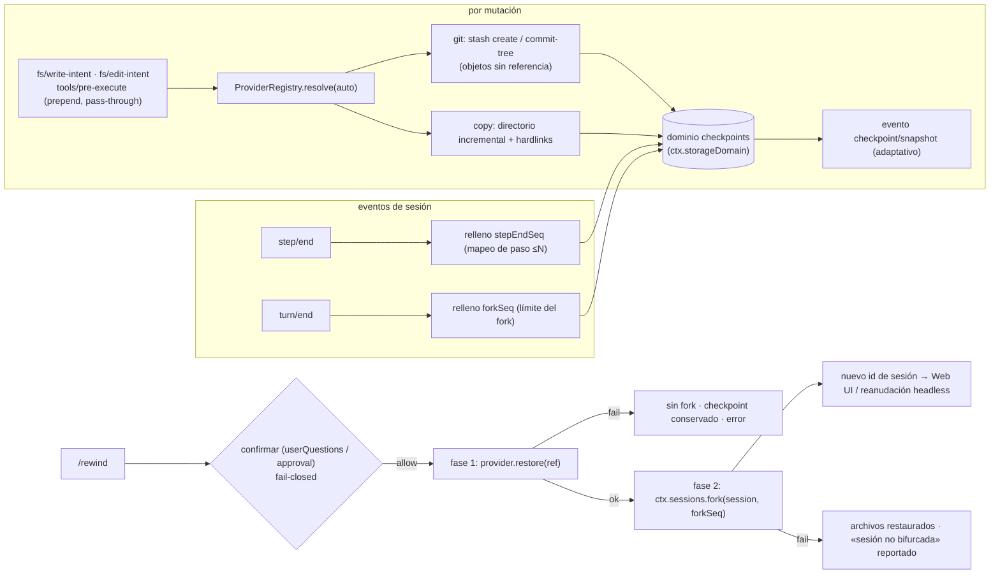

# dsh-checkpoint-rewind

[English](README.md) · [中文](README.zh.md) · **Español** · [Português](README.pt.md) · [हिन्दी](README.hi.md)

**`/rewind` de Claude Code, bien hecho para DeepSeek Harness.**

Un plugin de capability-seam que añade **instantáneas de archivos del workspace + retroceso por límite de sesión** a [DeepSeek Harness](https://github.com/deepseek-ai/deepseek-harness): antes de cada herramienta que muta, el plugin captura el workspace (git primero, copia como respaldo) y un único comando `/rewind` restaura los archivos **y** bifurca (fork) la sesión hasta el límite de turno del checkpoint — así el contexto del modelo y los archivos en disco siempre coinciden.

[](LICENSE)
[](#)
[](#)
[](#pruebas)

> **Topics**: `dsh` · `dsh-plugin` · `deepseek-harness` · `rewind` · `checkpoint` · `session-fork` · `workspace-safety` · `undo` · `cordis-plugin`

**TL;DR**

- 📸 **Instantánea antes de cada mutación** — todos los caminos de escritura (`write`, `edit`, `str_replace_editor`, `bash`, …) se capturan primero, en silencio, vía listeners pass-through `fs/*-intent` + `tools/pre-execute`.
- 🧵 **git primero, sin riesgo histórico** — las instantáneas son objetos git sin referencia (`stash create` / `commit-tree`); la restauración es solo-worktree. Directorios sin git degradan a instantáneas incrementales de directorio.
- ⏪ **Un comando para volver** — `/rewind` lista checkpoints; `/rewind <id>` confirma, restaura archivos, luego bifurca la sesión en el límite de turno del checkpoint y devuelve el id de la nueva sesión.
- 🔒 **Fail-closed por diseño** — restaurar requiere confirmación humana; sin respondedor no hay restauración. Nada de `git reset --hard`, nada de `git clean`, nunca edición de mensajes.

---

## ¿Por qué otro plugin de rewind?

| Plugin | Qué vende | ¿Restaura archivos? | ¿Retrocede la sesión? |
|---|---|---|---|
| **dsh-checkpoint-rewind** (este) | instantáneas con objetos git + fork por turno + restauración de un paso | ✅ estado completo del workspace | ✅ sesión hija con fork |
| [Anionex/dsh-turn-rewind](https://github.com/Anionex/dsh-turn-rewind) | Change Ledger persistente de deltas por mutación | ✅ repitiendo deltas inversos | ✅ su propio modelo de ledger |
| [LingLambda/dsh-undo](https://github.com/LingLambda/dsh-undo) | retroceso solo de contexto al último paso completado | ❌ | ✅ solo contexto |
| [Mongfayi/dsh-recall](https://github.com/Mongfayi/dsh-recall) | retirada de mensajes (borra el turno y lo posterior) | ❌ (explícitamente) | ✅ borrado de turno |

La diferencia en una frase: **dsh-checkpoint-rewind captura el *estado del workspace* con primitivas git sin efectos secundarios antes de cada mutación y convierte «volver al paso N» en un comando aprobado — primero se restauran los archivos, luego se bifurca la sesión, cada fase queda registrada.** Sin libro de deltas que se desincronice, sin edición de mensajes (eso es otro plugin), sin sincronización entre dispositivos.

## Características

- **Instantáneas antes de cada mutación** — escucha pass-through con `prepend` en `fs/write-intent` / `fs/edit-intent` más `tools/pre-execute` para mutadores no-fs (`bash`, …), cubriendo *todos* los caminos de cambio sin robar el slot de decisión de la política.
- **Provider seam** — `git` primero: `git stash create` / `git commit-tree` producen objetos de instantánea sin referencia que **jamás tocan worktree, índice o historial**; la restauración es `git restore` solo-worktree. Directorios sin git degradan a `copy` (instantáneas incrementales con hardlinks), claramente etiquetados en la lista.
- **Mapeo por paso, forks por turno** — cada checkpoint registra su turno/paso; `step/end` rellena el mapeo de pasos («volver al paso N» = instantánea más cercana ≤ N) y `turn/end` rellena el límite del fork, usando el primitivo real `ctx.sessions.fork` del harness.
- **Transacción de rewind en dos fases** — `/rewind <id>` pide confirmación (seam userQuestions / approval, **fail-closed sin respondedor**), restaura archivos primero y luego bifurca; un fallo de restauración nunca bifurca, un fallo de fork informa «archivos restaurados, sesión no bifurcada» y conserva el checkpoint.
- **Registro durable + cuotas** — los registros viven en `ctx.storageDomain` (dominio `checkpoints`; backend SQLite = filas, backend JSON = archivo legible); `maxSnapshots` (por sesión, 50 por defecto), `maxSnapshotBytes` (global, 512 MiB por defecto), `pruneOnTurnEnd`, primero-lo-más-antiguo.
- **Reconstruible por diseño** — la salida de `/rewind` viaja en los eventos propios del harness `command/run` + `command/done`; los eventos `checkpoint/snapshot|bound|prune|rewind` están declarados y se añaden automáticamente cuando un build del host los conozca (puerta adaptativa rc.6).
- **Proyección lista para la Web** — una unidad de proyección de sesión `checkpoints` se registra siempre que exista `ctx.sessionProjections`, de modo que un panel del shell puede renderizar la franja de checkpoints desde el log de eventos sin cambios en el plugin.
- **Rewind consciente del modelo** — la sesión hija bifurcada recibe un aviso inyectado (`user/message`, fuente plugin) con el checkpoint y el alcance de la restauración, para que el modelo reanudado no continúe con resultados de herramientas obsoletos.

## Compatibilidad

| Requisito | Estado | Última verificación |
|---|---|---|
| DeepSeek Harness `0.1.0-rc.6` (npm `next`) | ✅ nivel de carga verificado | 2026-08-14 (instalación vía tarball → `dsh --profile headless --dump-config` muestra la capa; la ejecución solo se detiene en la etapa de credenciales) |
| Node `^22.19 \|\| >=24` | ✅ matriz CI | 2026-08-14 |
| `git` | opcional | solo para el provider git; directorios sin git degradan a `copy` automáticamente |

## Inicio rápido

`dsh-checkpoint-rewind` se distribuye como **bundle plugin** (sin paso de build, ESM puro):

```sh
dsh plugin add dsh-checkpoint-rewind    # entra en la pila de bundles del perfil
# reinicia dsh — /rewind ya está activo en la Web UI.
```

O móntalo directamente para experimentar:

```sh
pnpm dsh web --patch ./cordis.patch.yml
```

Desinstalar (elimina el comando y los listeners; los snapshots persisten hasta que los borres):

```sh
dsh plugin --profile <name> remove dsh-checkpoint-rewind
rm -rf "$DSH_HOME/dsh-checkpoint-rewind"   # snapshots del provider copy; los objetos git los recoge el gc
```

Las mutaciones del workspace ahora crean checkpoints automáticamente:

```text
/rewind
```

```text
rewind: 3 checkpoints (newest last):
#a1b2c3d4-e5f6-… · (git) · turn 2 step 1 · 2026-08-14 12:00:01 · trigger: bash · 4 files · 1.2 MiB · fork: ready
#b2c3d4e5-f6a7-… · (git) · turn 2 step 3 · 2026-08-14 12:00:41 · trigger: str_replace_editor · 2 files · 310 KiB · fork: ready
#c3d4e5f6-a7b8-… · (copy) · turn 3 step 1 · 2026-08-14 12:01:10 · trigger: write · 1 file · 90 KiB · fork: pending (turn not closed)
run "/rewind <id>" to restore files and fork the session from that checkpoint
```

```text
/rewind b2c3d4e5-f6a7-…
```

El plugin pregunta **«Restore the workspace files to this checkpoint and fork the session?»** → al aprobarse restaura los archivos, bifurca la sesión en el límite de turno del checkpoint y devuelve el id de la nueva sesión:

```text
rewind: restored 2 file(s) from checkpoint b2c3d4e5-f6a7-… (provider git)
and forked a new session at seq 87 (end of turn 2).
session: session-123
Open the new session to continue from before that turn; this session keeps its later history.
```

Las ejecuciones headless imprimen el mismo resultado con guía de reanudación; el shell Web puede navegar con el `session:` devuelto (ver [ancla Web UI](#ancla-web-ui)).

## Demo

Una ejecución headless ensamblada real (`npm run test:integration`): el agente modifica `a.txt` en el turno 1 y `b.txt` en el turno 2, luego un `/rewind` restaura ambos archivos y bifurca la sesión. (Transcripción literal.)

```console
[rewind-integration] copy flow: mounted; workspace C:\Users\me\Temp\dsh-rewind-int-ws-mpnQDg
[rewind-integration]   /rewind list:
    rewind: 2 checkpoints (newest last):
    #5889f233-6730-44dd-98dd-3b24cca09e77 · (copy) · turn 1 step 1 · 2026/8/14 04:30:18 · trigger: fs/write-intent · 2 files · 10 B · fork: ready
    #03fb9ea6-8b50-4284-b768-98d5acb155f0 · (copy) · turn 2 step 1 · 2026/8/14 04:30:18 · trigger: fs/write-intent · 2 files · 10 B · fork: ready
    run "/rewind <id>" to restore files and fork the session from that checkpoint
[rewind-integration]   [user-questions] asked: Restore the workspace files to this checkpoint and fork the session?
[rewind-integration]   /rewind result: rewind: restored 2 file(s) from checkpoint 5889f233-… (provider copy)
and forked a new session at seq 3 (end of turn 1).
session: session-1
Open the new session to continue from before that turn; this session keeps its later history.
[rewind-integration]   fork ok: child session-1 seedLength 4 parent integration-session
[rewind-integration] copy flow: PASS
[rewind-integration] git flow: mounted; workspace C:\Users\me\Temp\dsh-rewind-int-git-MhDhwe
[rewind-integration]   git restore ok; HEAD intact: 9c21ee5e
[rewind-integration] git flow: PASS
[rewind-integration] integration: ALL PASS
```

## Configuración

Todo es un campo de `Config` (cambiable desde cordis.yml; nada está hardcodeado):

| Clave | Por defecto | Significado |
|---|---:|---|
| `enabled` | `true` | Interruptor maestro; `false` elimina comando, listeners y providers. |
| `provider` | `auto` | Provider de instantánea: `auto` (git si está disponible, si no copy) · `git` (falla alto en directorios sin git) · `copy`. |
| `gitBin` | `git` | Ruta del ejecutable git. |
| `snapshotDir` | `$DSH_HOME/dsh-checkpoint-rewind` | Raíz de instantáneas del provider copy. |
| `maxSnapshots` | `50` | Checkpoints conservados **por sesión** (se poda lo más antiguo primero). |
| `maxSnapshotBytes` | `536870912` (512 MiB) | Cuota global de contenido entre sesiones (lo más antiguo primero). |
| `pruneOnTurnEnd` | `true` | Ejecuta la poda de cuota al terminar un turno. |
| `mutationTools` | `['bash','write','edit','str_replace_editor']` | Herramientas tratadas como mutadoras en `tools/pre-execute` (las fs ya están cubiertas por `fs/*-intent`). |
| `excludeGlobs` | `['node_modules','.git','.dsh','dist','build']` | Directorios/archivos omitidos por el provider copy (`.git` y el directorio de instantáneas siempre se excluyen). |
| `confirmVia` | `auto` | Canal de confirmación: `auto` (userQuestions primero, luego approval) · `userQuestions` · `approval`. |
| `listLimit` | `10` | Checkpoints mostrados por `/rewind` sin argumentos. |

```yaml
- insert:
    - id: checkpoint-rewind
      name: dsh-checkpoint-rewind
      config:
        provider: auto
        maxSnapshots: 50
        maxSnapshotBytes: 536870912
        pruneOnTurnEnd: true
        confirmVia: auto
```

## Modelo de seguridad

- **El historial de git es intocable.** El provider git solo ejecuta primitivas sin efectos secundarios de una lista blanca — `stash create`, `commit-tree`, `restore --worktree`, `ls-tree`, `diff-tree`, `ls-files`, `status`, `rev-parse` — aplicada con aserción en runtime. **Nada de `reset --hard`, nada de `clean`, jamás mutar índice o historial.**
- **Restaurar requiere aprobación.** Sobrescribir archivos del usuario siempre pasa por el seam de confirmación con semántica `ask`; un respondedor ausente, que lanza o que dice no **cierra en falso**.
- **Rollback por sobrescritura, nunca borrado.** Ambos providers restauran archivos capturados e *informan* los archivos creados después del checkpoint (git: sin seguimiento; copy: extras del manifest) en lugar de borrarlos.
- **Transacción de dos fases, orden fijo.** Archivos primero, fork después; cada fase se registra; una restauración fallida deja archivos, checkpoints y sesión intactos.
- **Visible para el modelo ⟺ registrado.** Todo lo que ven usuarios o modelos es reconstruible desde el log de sesión (`command/run` + `command/done` y, cuando el host los conozca, los eventos `checkpoint/*`) más el dominio durable `checkpoints`.

## Cómo funciona

`checkpoint/snapshot` (creación) → `checkpoint/bound` (relleno de step/end y turn/end) → `/rewind` (listar / confirmar / restaurar en dos fases):



Registro completo de decisiones, vocabulario de eventos y contrato del provider seam: [ARCHITECTURE.md](ARCHITECTURE.md).

## Eventos de sesión (nota rc.6)

El plugin declara `checkpoint/snapshot`, `checkpoint/bound`, `checkpoint/prune` y `checkpoint/rewind` como miembros log-only de `SessionEventMap`. El harness rc.6 **no tiene superficie de registro de eventos para plugins** y `Session.append` no puede marcar tipos desconocidos como `ignorable`, por lo que añadirlos haría la sesión ilegible al recargar. El plugin añade eventos mediante una **puerta adaptativa** (`KNOWN_SESSION_EVENT_TYPES`): se omiten hoy y se habilitan automáticamente cuando un build del host incluya los tipos. Hasta entonces, la cadena de auditoría autoritativa es `command/run` + `command/done` (conocidos por el harness) más el dominio durable `checkpoints`.

## Ancla Web UI

El plugin ya devuelve el id de la nueva sesión en el resultado del comando (`session: <id>`) y el shell Web puede navegar allí. La **unidad de proyección de sesión `checkpoints` ya se distribuye**: cuando `ctx.sessionProjections` existe, el plugin registra la unidad (pliega `checkpoint/snapshot|bound|prune|rewind` en un valor de lista completa, `stateVersion` 0) — permanece como lista vacía en hosts rc.6 hasta que un build del harness incluya el vocabulario `checkpoint/*`, y entonces se llena sin cambios en el plugin. El seguimiento restante es del shell: el **panel de solo lectura** que renderiza esa proyección (ver [ARCHITECTURE.md](ARCHITECTURE.md#todo-web-ui-checkpoint-strip)).

## FAQ

**¿Sustituye a git?** No — lo *usa*. En un repositorio git obtienes objetos de instantánea byte-exactos y deduplicados sin tocar el historial; en cualquier otro directorio el provider copy hace lo mismo con archivos normales. Tus commits habituales siguen siendo tu historial a largo plazo.

**¿Por qué no `git reset --hard`?** Porque destruir estado no es el trabajo de una red de seguridad. El plugin solo crea objetos sin referencia y restaura solo el worktree, así que un rewind fallido jamás pierde historial, índice ni archivos creados después del checkpoint.

**¿Puedo volver a un paso en mitad de un turno?** La restauración de archivos es precisa a nivel de paso (instantánea más cercana ≤ N). El fork de sesión respeta la granularidad del harness: la sesión hija termina en el `turn/end` del checkpoint, porque `ctx.sessions.fork` rechaza prefijos dentro de un turno abierto. Archivos y conversación permanecen consistentes en ese límite.

**¿Qué pasa si nadie puede responder a la confirmación?** No se toca nada — el plugin cierra en falso (`unavailable`/`rejected`), conserva el checkpoint y devuelve un error explicativo.

## Pruebas

```sh
npm install
npm test                 # 60 tests unitarios: creación/dedup/concurrencia de instantáneas, rutas git y no-git,
                         # mapeo de límite ≤N, cuotas de poda, matriz de fallos de dos fases, rechazo de
                         # aprobación, puerta adaptativa de eventos, unidad de proyección checkpoints
                         # (Cordis real + SessionStore/CommandRuntime/SessionProjectionRegistry reales)
npm run test:integration # verificación headless ensamblada: el agente modifica 2 archivos en 2 turnos,
                         # /rewind lista → restaura → contenidos y contexto del fork asegurados
```

## Solución de problemas

| Síntoma | Causa / solución |
|---|---|
| `/rewind <id>` dice `rewind cancelled: no confirmation answerer` | No hay canal userQuestions/approval montado — el plugin cierra en falso. Ejecuta en la Web UI (o monta un proveedor de preguntas); `confirmVia` elige el canal. |
| `rewind: checkpoint registry unavailable` | El dominio de almacenamiento `checkpoints` no pudo abrirse (backend faltante/erróneo). Revisa los logs y la ruta del backend del dominio. |
| Un checkpoint muestra `fork: pending (turn not closed)` | Su turno aún no tiene `turn/end`; los archivos sí se restauran, el fork espera el cierre del turno. |
| `files restored … but the session was NOT forked` | Fase 2 de la transacción falló (sin límite cerrado o fork rechazado). Los archivos quedan restaurados; el checkpoint y la sesión actual no se tocan — el resultado indica la razón. |
| `MISSING_CREDENTIAL` en headless | No relacionado: falta `DEEPSEEK_API_KEY` para el proveedor. |
| Crece el almacenamiento de snapshots | La poda corre tras cada snapshot y en `turn/end` (`pruneOnTurnEnd`); baja `maxSnapshots`/`maxSnapshotBytes` o borra `$DSH_HOME/dsh-checkpoint-rewind` tras desinstalar. |

## Permisos y datos

| Recurso | Acceso |
|---|---|
| Archivos del workspace | lectura para snapshots; escritura solo en una restauración `/rewind <id>` aprobada (sobrescritura, nunca borrado) |
| Almacenamiento de snapshots | escribe solo bajo `snapshotDir` (por defecto `$DSH_HOME/dsh-checkpoint-rewind/`) |
| Repositorio git | solo primitivas whitelisted sin efectos secundarios (`stash create`, `commit-tree`, `restore --worktree`, …) — jamás `reset --hard`/`clean` |
| Log de sesión | lectura de límites; añade eventos log-only `checkpoint/*` cuando el host los conoce |
| Red / credenciales | ninguna — totalmente local |

## Licencia

Apache License 2.0 — ver [LICENSE](LICENSE), [THIRD_PARTY_NOTICES.md](THIRD_PARTY_NOTICES.md) y la política de seguridad en [SECURITY.md](SECURITY.md).

## Plugins relacionados

- **dsh-memento** — memoria entre sesiones acotada y con puerta de aprobación (mismas convenciones de plugin).
- [Anionex/dsh-turn-rewind](https://github.com/Anionex/dsh-turn-rewind) · [LingLambda/dsh-undo](https://github.com/LingLambda/dsh-undo) — las alternativas de las que este plugin se diferencia (tabla de arriba).
