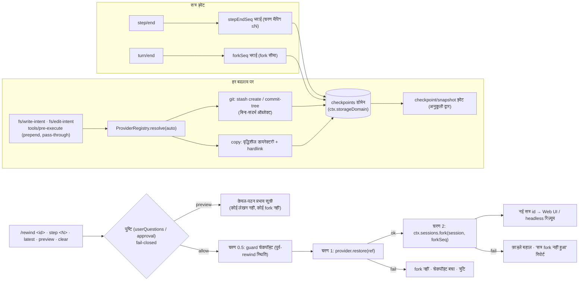

# dsh-checkpoint-rewind

[English](README.md) · [中文](README.zh.md) · [Español](README.es.md) · [Português](README.pt.md) · **हिन्दी**

**DeepSeek Harness के लिए Claude Code का `/rewind`, सही तरीके से बनाया गया।**

एक capability-seam प्लगइन जो [DeepSeek Harness](https://github.com/deepseek-ai/deepseek-harness) में **वर्कस्पेस फ़ाइल स्नैपशॉट + सत्र-सीमा रोलबैक** जोड़ता है: हर mutating टूल के निष्पादन से पहले प्लगइन वर्कस्पेस कैप्चर करता है (git पहले, कॉपी फ़ॉलबैक), और एक `/rewind` कमांड फ़ाइलों को पुनर्स्थापित करता है **और** सत्र को चेकपॉइंट की टर्न-सीमा तक fork करता है — ताकि मॉडल का संदर्भ और डिस्क की फ़ाइलें हमेशा एक जैसी रहें।

[](LICENSE)
[](https://www.npmjs.com/package/dsh-checkpoint-rewind)
[](https://www.npmjs.com/package/dsh-checkpoint-rewind)
[](https://github.com/PerryLink/dsh-checkpoint-rewind/actions/workflows/ci.yml)
[](#)
[](#)

> **Topics**: `dsh` · `dsh-plugin` · `deepseek-harness` · `rewind` · `checkpoint` · `snapshot` · `session-fork` · `workspace-safety` · `undo` · `cordis-plugin`

**TL;DR**

- 📸 **हर बदलाव से पहले स्नैपशॉट** — लेखन के सभी रास्ते (`write`, `edit`, `str_replace_editor`, `bash`, `pwsh`, `terminal_send`, …) `fs/*-intent` + `tools/pre-execute` pass-through लिस्नर से पहले ही, चुपचाप कैप्चर होते हैं।
- 🧵 **git पहले, इतिहास को ज़रा भी ख़तरा नहीं** — स्नैपशॉट बिना-संदर्भ git ऑब्जेक्ट हैं (`stash create` / `commit-tree`); बहाली केवल-worktree और पथ-स्पष्ट है, इसलिए चेकपॉइंट के बाद बनी फ़ाइलें **कभी नहीं हटतीं**। गैर-git डायरेक्टरी वृद्धिशील डायरेक्टरी स्नैपशॉट पर डिग्रेड होती हैं।
- ⏪ **वापस जाने का एक ही कमांड** — `/rewind` चेकपॉइंट दिखाता है; `/rewind <id-prefix>` / `step <N>` / `latest` पुष्टि करके पहले फ़ाइलें बहाल करता है, फिर चेकपॉइंट की टर्न-सीमा पर सत्र fork करके नई सत्र id लौटाता है।
- 🔍 **कूदने से पहले पूर्वावलोकन** — `/rewind preview <target>` सटीक प्रभाव छापता है (कौन-सी फ़ाइलें अधिलेखित होंगी, चेकपॉइंट के बाद बनी फ़ाइलें जो बची रहेंगी) बिना कुछ छुए — न पुष्टि-प्रॉम्प्ट, न लेखन, न fork।
- 🛡️ **rewind स्वयं उलटने योग्य है** — बहाली से पहले पूर्व-rewind स्थिति का एक guard चेकपॉइंट कैप्चर होता है, इसलिए `/rewind <guard-id>` rewind को पूर्ववत कर देता है।
- 🔒 **डिज़ाइन से fail-closed** — बहाली के लिए मानवीय पुष्टि अनिवार्य; उत्तरदाता न हो तो बहाली नहीं। कभी `git reset --hard` नहीं, कभी `git clean` नहीं, कभी संदेश-संपादन नहीं, कभी सिमलिंक से होकर लेखन नहीं।

---

## एक और rewind प्लगइन क्यों?

| प्लगइन | क्या बेचता है | फ़ाइलें बहाल करता है? | सत्र वापस ले जाता है? |
|---|---|---|---|
| **dsh-checkpoint-rewind** (यही) | git-ऑब्जेक्ट स्नैपशॉट + टर्न-सीमा fork + एक-चरण बहाली | ✅ पूरा वर्कस्पेस स्टेट | ✅ fork-सीडेड चाइल्ड सत्र |
| [Anionex/dsh-turn-rewind](https://github.com/Anionex/dsh-turn-rewind) | हर बदलाव के डेल्टा का स्थायी Change Ledger | ✅ उल्टे डेल्टा दोहराकर | ✅ अपना ledger मॉडल |
| [LingLambda/dsh-undo](https://github.com/LingLambda/dsh-undo) | केवल संदर्भ को पिछले पूर्ण चरण तक रोलबैक | ❌ | ✅ केवल संदर्भ |
| [Mongfayi/dsh-recall](https://github.com/Mongfayi/dsh-recall) | संदेश वापसी (टर्न और उसके बाद सब हटाता है) | ❌ (स्पष्ट रूप से) | ✅ टर्न हटाना |

एक वाक्य में अंतर: **dsh-checkpoint-rewind हर बदलाव से पहले बिना साइड-इफ़ेक्ट वाली git प्रिमिटिव से *वर्कस्पेस स्टेट* कैप्चर करता है और "चरण N पर वापस जाओ" को एक स्वीकृत कमांड बनाता है — पहले guard चेकपॉइंट, फिर फ़ाइलें बहाल, फिर सत्र fork, हर चरण लॉग होता है।** कोई डेल्टा-बही नहीं जो असंगत हो जाए, संदेश-स्तरीय संपादन नहीं (वह दूसरे प्लगइन का काम है), क्रॉस-डिवाइस सिंक नहीं।

## विशेषताएँ

- **हर बदलाव से पहले स्नैपशॉट** — `fs/write-intent` / `fs/edit-intent` पर prepend pass-through लिस्नर और गैर-fs mutators (`bash`, `pwsh`, `terminal_send`, …) के लिए `tools/pre-execute`, ताकि *हर* बदलाव का रास्ता कवर हो और नीति का निर्णय-स्लॉट न छिने।
- **Provider seam** — `git` पहले: `git stash create` / `git commit-tree` बिना-संदर्भ वाले स्नैपशॉट ऑब्जेक्ट बनाते हैं जो **कभी worktree, index या इतिहास नहीं छूते**; बहाली केवल-worktree है और केवल **स्पष्ट पथ** बहाल करती है — `git restore … -- .` चेकपॉइंट के बाद `git add` की गई फ़ाइलें हटा देता, इसलिए provider उसे कभी जारी नहीं करता। बिना-प्रारंभिक-कमिट (unborn HEAD) वाले रिपॉज़िटरी का पता लगाकर `copy` पर डिग्रेड होते हैं; उपलब्धता जाँच प्रति-वर्कस्पेस कैश रहती है। गैर-git डायरेक्टरी `copy` पर डिग्रेड होती हैं (hardlink पुनर्प्रयोग के साथ वृद्धिशील डायरेक्टरी स्नैपशॉट), सूची में स्पष्ट लेबल के साथ।
- **चरण-स्तरीय मैपिंग, टर्न-स्तरीय fork** — हर चेकपॉइंट अपना turn/step दर्ज करता है; `step/end` चरण मैपिंग भरता है ("चरण N पर वापस" = निकटतम ≤N स्नैपशॉट, `/rewind step <N>` से पहुँचने योग्य) और `turn/end` fork सीमा भरता है, harness के असली `ctx.sessions.fork` प्रिमिटिव का उपयोग करके।
- **तीन-चरणीय rewind ट्रांज़ैक्शन** — `/rewind <id>` पुष्टि माँगता है (userQuestions / approval seam, **उत्तरदाता न होने पर fail-closed**), वर्तमान स्थिति का **guard चेकपॉइंट** कैप्चर करता है (कॉन्फ़िग `preRewindCheckpoint`), फिर फ़ाइलें बहाल करता है, अंत में fork करता है; बहाली विफल हो तो fork कभी नहीं, fork विफल हो तो "फ़ाइलें बहाल, सत्र fork नहीं हुआ" बताता है — और guard चेकपॉइंट पूरे rewind को उलटने योग्य बनाता है।
- **केवल-पठन प्रभाव पूर्वावलोकन** — `/rewind preview <target>` (वही संबोधन: id-प्रीफ़िक्स, `step <N>`, `latest`) ठीक-ठीक दिखाता है कि बहाली किन फ़ाइलों को अधिलेखित करेगी और चेकपॉइंट के बाद की कौन-सी फ़ाइलें बची रहेंगी — बिना पुष्टि-द्वार, बिना लेखन, बिना fork — अंधी छलाँग की जगह सूचित स्वीकृति।
- **टिकाऊ रजिस्ट्री + कोटा** — रिकॉर्ड `ctx.storageDomain` (डोमेन `checkpoints`; SQLite बैकएंड = पंक्तियाँ, JSON बैकएंड = पठनीय फ़ाइल) में रहते हैं; `maxSnapshots` (प्रति सत्र, डिफ़ॉल्ट 50) और `maxSnapshotBytes` (वैश्विक **वृद्धिशील-बाइट** सॉफ़्ट कोटा, डिफ़ॉल्ट 512 MiB; हर सत्र का नवीनतम चेकपॉइंट हमेशा बचा रहता है, इसलिए बड़े वर्कस्पेस कभी खुद-ब-खुद नहीं कटते), `pruneOnTurnEnd`, सबसे-पुराना-पहले।
- **copy अखंडता विकल्प** — `verifyByHash` से copy provider आकार+mtime की जगह सामग्री-हैश की तुलना करता है (`touch -r` / `rsync -t` से सटीक-mtime बहाली भी समान-आकार के सामग्री-बदलाव को छिपा नहीं सकती) और बहाल सामग्री सत्यापित करता है; फ़ाइल mode यथासंभव बहाल होते हैं।
- **डिज़ाइन से पुनर्निर्माणीय** — `/rewind` का आउटपुट harness के अपने `command/run` + `command/done` इवेंट पर चलता है; `checkpoint/snapshot|bound|prune|rewind` सत्र इवेंट तब जुड़ते हैं जब होस्ट इन प्रकारों को जानता हो **या** `ignorable` एन्वेलप का समर्थन करता हो (रनटाइम जाँच; rc.6 अनुकूली द्वार बंद और सुरक्षित रहता है)।
- **Web-तैयार प्रोजेक्शन** — जहाँ भी `ctx.sessionProjections` मौजूद है, सत्र-प्रोजेक्शन इकाई `checkpoints` (`ctx.inject` के ज़रिए) पंजीकृत होती है, ताकि shell पैनल बिना किसी प्लगइन बदलाव के इवेंट लॉग से चेकपॉइंट-पट्टी दिखा सके।
- **मॉडल-सजग rewind** — fork चाइल्ड सत्र में एक इंजेक्टेड सूचना (`user/message`, plugin स्रोत) जाती है जिसमें चेकपॉइंट, बहाली और guard चेकपॉइंट लिखा होता है, ताकि लौटा हुआ मॉडल पुराने टूल परिणामों पर आगे न बढ़े।

## अनुकूलता

| आवश्यकता | स्थिति | अंतिम सत्यापन |
|---|---|---|
| DeepSeek Harness `0.1.0-rc.6` (npm `next`) | ✅ लोड-स्तर सत्यापित | 2026-08-14 (tarball इंस्टॉल → `dsh --profile headless --dump-config` में परत दिखती है; रन केवल क्रेडेंशियल चरण पर रुकता है) |
| Node `^22.19 \|\| >=24` | ✅ CI मैट्रिक्स | 2026-08-14 |
| `git` | वैकल्पिक | केवल git provider के लिए; गैर-git डायरेक्टरी और unborn-HEAD रिपॉज़िटरी अपने-आप `copy` पर डिग्रेड |

## त्वरित शुरुआत

`dsh-checkpoint-rewind` एक **bundle plugin** के रूप में वितरित होता है (कोई बिल्ड चरण नहीं, शुद्ध ESM):

```sh
dsh plugin add dsh-checkpoint-rewind    # प्रोफ़ाइल के bundle स्टैक में जुड़ता है
# dsh पुनः आरंभ करें — /rewind Web UI में सक्रिय हो गया।
```

या प्रयोग के लिए सीधे माउंट करें:

```sh
pnpm dsh web --patch ./cordis.patch.yml
```

अनइंस्टॉल (कमांड और लिस्नर हटते हैं; स्नैपशॉट फ़ाइलें आपके हटाने तक बची रहती हैं):

```sh
dsh plugin --profile <name> remove dsh-checkpoint-rewind
rm -rf "$DSH_HOME/dsh-checkpoint-rewind"   # copy provider स्नैपशॉट; git ऑब्जेक्ट gc द्वारा एकत्रित
```

वर्कस्पेस में बदलाव होते ही चेकपॉइंट अपने-आप बनते हैं। Web UI में (या किसी भी इंटरैक्टिव एडेप्टर में):

```text
/rewind
```

```text
rewind: 3 checkpoints (newest last):
#a1b2c3d4 · (git) · turn 2 step 1 · 2026-08-14 12:00:01 (3 min ago) · trigger: bash · 4 files · 1.2 MiB · fork: ready
#b2c3d4e5 · (git) · turn 2 step 3 · 2026-08-14 12:00:41 · trigger: str_replace_editor · 2 files · 310 KiB · fork: ready
#c3d4e5f6 · (copy) · turn 3 step 1 · 2026-08-14 12:01:10 · trigger: write · 1 file · 90 KiB · fork: pending (turn not closed)
run "/rewind <id>" to restore files and fork the session from that checkpoint
```

चेकपॉइंट को उसके अद्वितीय id-प्रीफ़िक्स (सूची में दिखने वाला छोटा id काम करता है), चरण-संख्या या `latest` से संबोधित करें:

```text
/rewind b2c3d4e5
/rewind step 2
/rewind latest
/rewind preview b2c3d4e5   # केवल-पठन: दिखाता है कौन-सी फ़ाइलें बदलेंगी, कुछ नहीं छूता
/rewind clear        # इस सत्र के चेकपॉइंट की पुष्ट विलोपन (फ़ाइलें अछूती)
```

`preview` उसी संबोधन (`<id-prefix>`, `step <N>`, `latest`) से हल होता है और बिना पुष्टि माँगे, बिना कुछ लिखे प्रभाव छाप देता है:

```text
rewind preview: checkpoint #b2c3d4e5-… (provider git, turn 2 step 3)
restoring it would overwrite 2 file(s):
  src/app.ts
  src/util.ts
3 file(s) already match the checkpoint (not touched).
no files are deleted: 1 file(s) created after the checkpoint would be left in place:
  src/new.ts
run "/rewind <id>" to confirm and apply (a guard checkpoint is captured first)
```

प्लगइन पूछता है **"Restore the workspace files to this checkpoint and fork the session?"** → स्वीकृति पर यह guard चेकपॉइंट कैप्चर करता है, फ़ाइलें बहाल करता है, चेकपॉइंट की टर्न-सीमा पर सत्र fork करता है और नए सत्र का id लौटाता है:

```text
rewind: restored 2 file(s) from checkpoint b2c3d4e5-… (provider git)
and forked a new session at seq 87 (end of turn 2).
session: session-123
Open the new session to continue from before that turn; this session keeps its later history.
rewind guard: f6a7b8c9-… (run "/rewind f6a7b8c9" to undo this rewind)
```

headless रन वही परिणाम छापते हैं और आगे बढ़ने का मार्गदर्शन देते हैं; Web shell लौटाए गए `session:` id से नेविगेट कर सकता है (देखें [Web UI एंकर](#web-ui-एंकर))।

## डेमो

एक वास्तविक असेंबल्ड headless रन (`npm run test:integration`): एजेंट टर्न 1 में `a.txt` और टर्न 2 में `b.txt` बदलता है, बाद में `c.txt` बनाता है, फिर एक `/rewind preview` केवल-पठन रूप में प्रभाव देखता है और एक `/rewind` दोनों फ़ाइलें बहाल करके सत्र fork करता है। (शब्दशः ट्रांसक्रिप्ट; ध्यान दें वृद्धिशील बाइट-लेखांकन पर: दूसरे चेकपॉइंट में केवल बदली फ़ाइल की लागत आती है — और preview पंक्ति न पुष्टि माँगती है, न कुछ लिखती है।)

```console
[rewind-integration] copy flow: mounted; workspace C:\Users\me\Temp\dsh-rewind-int-ws-NTk6jw
[rewind-integration]   /rewind list:
    rewind: 2 checkpoints (newest last):
    #9ab2d753 · (copy) · turn 1 step 1 · 2026/8/15 12:57:05 (just now) · trigger: fs/write-intent · 2 files · 10 B · fork: ready
    #7ec0e96f · (copy) · turn 2 step 1 · 2026/8/15 12:57:05 (just now) · trigger: fs/write-intent · 2 files · 6 B · fork: ready
    run "/rewind <id>" to restore files and fork the session from that checkpoint
[rewind-integration]   /rewind preview ok (no gate, no writes): rewind preview: checkpoint #9ab2d753-… (provider copy, turn 1 step 1)
[rewind-integration]   [user-questions] asked: Restore the workspace files to this checkpoint and fork the session?
[rewind-integration]   /rewind result: rewind: restored 2 file(s) from checkpoint 9ab2d753-… (provider copy)
and forked a new session at seq 3 (end of turn 1).
session: session-1
Open the new session to continue from before that turn; this session keeps its later history.
1 file(s) created after the checkpoint were left in place (overwrite rollback never deletes files)
rewind guard: f18027ea-… (run "/rewind f18027ea" to undo this rewind)
[rewind-integration]   fork ok: child session-1 seedLength 4 parent integration-session
[rewind-integration] copy flow: PASS
[rewind-integration] git flow: mounted; workspace C:\Users\me\Temp\dsh-rewind-int-git-CXd4BQ
[rewind-integration]   /rewind preview ok (git): rewind preview: checkpoint #fd1dc3ad-… (provider git, turn 1 step 1)
[rewind-integration]   [user-questions] asked: Restore the workspace files to this checkpoint and fork the session?
[rewind-integration]   git restore ok; HEAD intact: 19484e99
[rewind-integration] git flow: PASS
[rewind-integration] integration: ALL PASS
```

## कॉन्फ़िगरेशन

सब कुछ `Config` फ़ील्ड है (cordis.yml से बदला जा सकता है; कुछ भी हार्डकोड नहीं):

| कुंजी | डिफ़ॉल्ट | अर्थ |
|---|---:|---|
| `enabled` | `true` | मास्टर स्विच; `false` पर कमांड, लिस्नर और providers सब हट जाते हैं। |
| `provider` | `auto` | स्नैपशॉट provider: `auto` (git उपलब्ध हो तो git, वरना copy) · `git` (गैर-git डायरेक्टरी पर ज़ोरदार विफलता) · `copy`। |
| `gitBin` | `git` | git एक्ज़ीक्यूटेबल का पथ। |
| `snapshotDir` | `$DSH_HOME/dsh-checkpoint-rewind` | copy provider के स्नैपशॉट की जड़। |
| `maxSnapshots` | `50` | **प्रति सत्र** रखे जाने वाले चेकपॉइंट (सबसे पुराना पहले हटेगा)। |
| `maxSnapshotBytes` | `536870912` (512 MiB) | सभी सत्रों में वैश्विक **वृद्धिशील-बाइट** सॉफ़्ट कोटा (सबसे पुराना पहले हटेगा; हर सत्र का नवीनतम चेकपॉइंट हमेशा बचा रहता है)। |
| `pruneOnTurnEnd` | `true` | टर्न समाप्त होने पर कोटा-प्रूनिंग चलाएँ। |
| `mutationTools` | `['bash','write','edit','str_replace_editor','pwsh','terminal_send']` | `tools/pre-execute` पर mutating माने जाने वाले टूल (fs टूल `fs/*-intent` से पहले ही कवर हैं)। |
| `excludeGlobs` | `['node_modules','.git','.dsh','dist','build']` | copy provider द्वारा छोड़े गए glob पैटर्न: `*` एक खंड के भीतर किसी भी वर्ण, `?` एक वर्ण, `**` किसी भी संख्या के खंड; बिना `/` वाला पैटर्न किसी भी गहराई के खंड-नाम से मेल खाता है, `/` वाला पैटर्न सापेक्ष पथ से मेल खाता है, और मेल खाती डायरेक्टरी अपना पूरा उप-वृक्ष बाहर कर देती है (`.git` और स्नैपशॉट डायरेक्टरी हमेशा बाहर)। |
| `confirmVia` | `auto` | पुष्टि चैनल: `auto` (पहले userQuestions, फिर approval) · `userQuestions` · `approval`। नोट: `approval` को खुला टर्न चाहिए और कमांड टर्न के बीच चलते हैं, इसलिए rc.6 पर यह कारगर संदेश के साथ fail-closed होता है — userQuestions माउंट करें। |
| `listLimit` | `10` | बिना-तर्क `/rewind` में दिखने वाले चेकपॉइंट। |
| `preRewindCheckpoint` | `warn` | बहाली से पहले guard चेकपॉइंट: `warn` (कैप्चर विफल हो तो चेतावनी देकर आगे बढ़ें) · `require` (rewind रोक दें) · `off`। |
| `verifyByHash` | `false` | copy provider की सामग्री-हैश तुलना और बहाली-सत्यापन (धीमा; size+mtime त्वरित-जाँच का अंध-बिंदु बंद करता है)। |

```yaml
- insert:
    - id: checkpoint-rewind
      name: dsh-checkpoint-rewind
      config:
        provider: auto
        maxSnapshots: 50
        maxSnapshotBytes: 536870912
        pruneOnTurnEnd: true
        confirmVia: auto
        preRewindCheckpoint: warn
```

## सुरक्षा मॉडल

- **git इतिहास अछूत है।** git provider केवल व्हाइटलिस्ट की साइड-इफ़ेक्ट-रहित प्रिमिटिव चलाता है — `stash create`, `commit-tree`, `restore --worktree`, `ls-tree`, `diff-tree`, `ls-files`, `status`, `rev-parse` — runtime assertion द्वारा लागू, और ऑब्जेक्ट ref git को देने से पहले हेक्स id के रूप में सत्यापित होते हैं (छेड़छाड़ किया रिकॉर्ड git विकल्प नहीं घुसा सकता)। **कभी `reset --hard` नहीं, कभी `clean` नहीं, कभी index/इतिहास में बदलाव नहीं।**
- **ओवरराइट रोलबैक, कभी विलोपन नहीं।** बहाली केवल कैप्चर की गई फ़ाइलों को ओवरराइट करती है, और git provider **स्पष्ट पथ** बहाल करता है (`git restore … -- .` चेकपॉइंट के बाद `git add` की गई फ़ाइलें हटा देता)। चेकपॉइंट के बाद बनी फ़ाइलें (अनट्रैक्ड **या** staged) *रिपोर्ट* होती हैं और वहीं छूट जाती हैं।
- **कभी लिंक से होकर लेखन नहीं, कभी पथ-भेदन नहीं।** copy provider चेकपॉइंट ref को स्नैपशॉट-डायरेक्टरी पथ में जोड़ने से पहले उनका प्रारूप सत्यापित करता है, और जो गंतव्य (या उसका पूर्वज) सिमलिंक बन चुका हो उससे होकर बहाली करने से मना कर देता है — और जो स्नैपशॉट-स्टोरेज फ़ाइल सिमलिंक बन चुकी हो उसे पढ़ने से भी मना कर देता है — इसलिए बहाली कभी किसी लिंक का अनुसरण कर वर्कस्पेस से बाहर नहीं जा सकती। स्नैपशॉट ref और git ऑब्जेक्ट id की पर्सिस्टेंस-सीमा पर प्रारूप-जाँच होती है।
- **बहाली के लिए स्वीकृति अनिवार्य।** उपयोगकर्ता की फ़ाइलों पर लिखना हमेशा `ask` सिमेंटिक वाले पुष्टि seam से गुज़रता है; उत्तरदाता अनुपस्थित, त्रुटि फेंकने वाला या मना करने वाला हो तो **fail closed**। प्रभाव पहले केवल-पठन रूप में देखने का रास्ता `/rewind preview` है।
- **rewind उलटने योग्य है।** बहाली से पहले एक guard चेकपॉइंट वर्तमान स्थिति कैप्चर करता है; guard बहाल करने पर rewind पूर्ववत हो जाता है। `preRewindCheckpoint: require` पर guard कैप्चर न हो सके तो rewind रोक दिया जाता है।
- **तीन-चरणीय ट्रांज़ैक्शन, निश्चित क्रम।** पहले guard, फिर फ़ाइलें, अंत में fork; हर चरण लॉग होता है; विफल बहाली फ़ाइलों, चेकपॉइंट और सत्र को अछूता छोड़ती है।
- **मॉडल-दृश्य ⟺ लॉग।** उपयोगकर्ता या मॉडल जो कुछ देखते हैं वह सत्र लॉग (`command/run` + `command/done` और, होस्ट के जानते ही, `checkpoint/*` इवेंट) + टिकाऊ `checkpoints` डोमेन से पुनर्निर्माणीय है।

## यह कैसे काम करता है

`checkpoint/snapshot` (निर्माण) → `checkpoint/bound` (step/end व turn/end भराई) → `/rewind` (सूची / पुष्टि / guard / बहाली / fork):



पूरा निर्णय-रिकॉर्ड, इवेंट शब्दावली और provider seam अनुबंध: [ARCHITECTURE.md](ARCHITECTURE.md)।

## सत्र इवेंट (rc.6 नोट)

प्लगइन `checkpoint/snapshot`, `checkpoint/bound`, `checkpoint/prune` और `checkpoint/rewind` को log-only `SessionEventMap` सदस्यों के रूप में घोषित करता है। harness rc.6 में **प्लगइन इवेंट-पंजीकरण सतह नहीं है** और `Session.append` अज्ञात विकल्प-कुंजियों को चुपचाप छोड़ देता है, इसलिए अज्ञात प्रकार जोड़ने से सत्र रीलोड पर अपठनीय हो जाता। इसलिए प्लगइन **अनुकूली द्वार** से इवेंट जोड़ता है: एक रनटाइम जाँच (एक अलग, कभी-पर्सिस्ट-न-होने वाले session store पर) पता लगाती है कि होस्ट का `append` `ignorable` एन्वेलप मुहर लगाता है या नहीं — rc.6 पर द्वार बंद रहता है; जो होस्ट इसे समर्थन देते हैं वहाँ `checkpoint/*` इवेंट अपने-आप `ignorable: true` के साथ जुड़ते हैं। तब तक आधिकारिक ऑडिट-शृंखला harness-ज्ञात `command/run` + `command/done` और टिकाऊ `checkpoints` स्टोरेज डोमेन है।

## Web UI एंकर

प्लगइन पहले से ही कमांड परिणाम में नया सत्र id लौटाता है (`session: <id>`) और Web shell वहाँ नेविगेट कर सकता है। **सत्र-प्रोजेक्शन इकाई `checkpoints` अब साथ वितरित होती है**: जहाँ `ctx.sessionProjections` मौजूद है, प्लगइन इकाई `ctx.inject` के ज़रिए पंजीकृत करता है (`checkpoint/snapshot|bound|prune|rewind` को संपूर्ण-सूची मान में मोड़ना, `stateVersion` 0) — rc.6 होस्ट पर यह खाली सूची रहती है जब तक कोई harness बिल्ड `checkpoint/*` शब्दावली या `ignorable` एन्वेलप नहीं लाता, फिर बिना किसी प्लगइन बदलाव के भर जाती है। शेष अनुवर्ती कार्य shell का है: उस प्रोजेक्शन को दिखाने वाला **केवल-पढ़ने वाला पैनल** (देखें [ARCHITECTURE.md](ARCHITECTURE.md#todo-web-ui-checkpoint-strip))।

## FAQ

**क्या यह git की जगह लेता है?** नहीं — यह git का *उपयोग* करता है। git रिपॉज़िटरी में आपको इतिहास छुए बिना बाइट-सटीक, डिडुप किए स्नैपशॉट ऑब्जेक्ट मिलते हैं; किसी भी अन्य डायरेक्टरी में copy provider सामान्य फ़ाइलों से वही करता है। आपके नियमित commits ही आपका दीर्घकालिक इतिहास हैं।

**`git reset --hard` क्यों नहीं?** क्योंकि स्टेट नष्ट करना सुरक्षा-जाल का काम नहीं है। प्लगइन केवल बिना-संदर्भ ऑब्जेक्ट बनाता है और केवल-worktree, पथ-स्पष्ट बहाली करता है, इसलिए कोई गलत rewind कभी इतिहास, index या चेकपॉइंट के बाद बनी फ़ाइलें नहीं खो सकता।

**क्या मैं किसी टर्न के बीच के चरण पर वापस जा सकता हूँ?** फ़ाइल-बहाली चरण-स्तर पर सटीक है (`/rewind step <N>` = निकटतम ≤N स्नैपशॉट)। सत्र fork harness की ग्रैन्युलैरिटी का पालन करता है: चाइल्ड सत्र चेकपॉइंट के `turn/end` पर समाप्त होता है, क्योंकि `ctx.sessions.fork` खुले टर्न के अंदर के प्रीफ़िक्स अस्वीकार करता है। उस सीमा पर फ़ाइलें और बातचीत संगत रहते हैं।

**अगर पुष्टि का उत्तर कोई न दे सके तो?** कुछ नहीं छुआ जाता — प्लगइन fail-closed होता है (`unavailable`/`rejected`), चेकपॉइंट बचा रहता है और व्याख्यात्मक त्रुटि लौटती है। rc.6 पर `confirmVia: approval` हो तो संदेश userQuestions माउंट करने को कहता है, क्योंकि approval को खुला टर्न चाहिए और कमांड टर्न के बीच चलते हैं।

**क्या मैं rewind पूर्ववत कर सकता हूँ?** हाँ — हर स्वीकृत rewind पहले पूर्व-rewind स्थिति का guard चेकपॉइंट कैप्चर करता है; परिणाम में `rewind guard: <id>` छपता है और `/rewind <guard-id>` उस स्थिति को बहाल कर देता है।

**चेकपॉइंट कैसे संबोधित करूँ?** अद्वितीय id-प्रीफ़िक्स (सूची का 8-अक्षरीय छोटा id काम करता है), `/rewind step <N>`, `/rewind latest`, या इस सत्र के चेकपॉइंट हटाने के लिए `/rewind clear` (फ़ाइलें अछूती)। `/rewind preview <target>` उसी संबोधन से बिना कुछ बदले प्रभाव दिखाता है।

**`preview` क्या करता है — और क्या नहीं?** यह चेकपॉइंट हल करके केवल-पठन तुलना चलाता है: कौन-सी फ़ाइलें अधिलेखित (या फिर से बनी) होंगी, कौन-सी पहले से मेल खाती हैं, और चेकपॉइंट के बाद बनी कौन-सी फ़ाइलें वहीं बची रहेंगी। यह कभी पूछता नहीं, कभी लिखता नहीं, कभी fork नहीं करता और कोई `checkpoint/rewind` इवेंट दर्ज नहीं करता — स्वीकृति द्वार केवल असली `/rewind <id>` पर चलता है।

## परीक्षण

```sh
npm install
npm test                 # 160 यूनिट टेस्ट (test/**/*.test.mjs, provider सुइट सहित):
                         # स्नैपशॉट निर्माण/डिडप/समवर्ती, git व गैर-git पथ, unborn-HEAD
                         # डिग्रेडेशन, वृद्धिशील-बाइट कोटा + नवीनतम-बचाव सीमा, staged-फ़ाइल
                         # बहाली-सुरक्षा, ≤N सीमा मैपिंग, तीन-चरणीय विफलता मैट्रिक्स, approval
                         # अस्वीकृति, संबोधन (प्रीफ़िक्स/step/latest/preview/clear), guard चेकपॉइंट
                         # मोड, अनुकूली इवेंट द्वार + ignorable जाँच, हैश-सत्यापन, glob-बहिष्करण
                         # सिमेंटिक्स, सिमलिंक/ref पथ-सुरक्षा सख़्ती, checkpoints प्रोजेक्शन इकाई
                         # (असली Cordis + असली SessionStore/CommandRuntime/SessionProjectionRegistry)
npm run test:integration # असेंबल्ड headless सत्यापन: एजेंट 2 टर्न में 2 फ़ाइलें बदलता है,
                         # /rewind सूची → preview (बिना द्वार, बिना लेखन) → बहाली → फ़ाइल सामग्री + fork
                         # संदर्भ + guard + चेकपॉइंट-पश्चात फ़ाइल का बचना सुनिश्चित
```

## समस्या निवारण

| लक्षण | कारण / समाधान |
|---|---|
| `/rewind <id>` कहता है `rewind cancelled: no confirmation answerer` | कोई userQuestions/approval चैनल नहीं है — प्लगइन fail-closed होता है। Web UI में चलाएँ (या प्रश्न-प्रदाता माउंट करें); `confirmVia` चैनल चुनता है। |
| `/rewind <id>` कहता है `approval requires an open turn …` | कमांड टर्न के बीच चलते हैं और approval को खुला टर्न चाहिए — userQuestions माउंट करें या `confirmVia: userQuestions` सेट करें। |
| `rewind: checkpoint registry unavailable` | `checkpoints` स्टोरेज डोमेन नहीं खुला (बैकएंड अनुपस्थित/त्रुटिपूर्ण)। harness लॉग व डोमेन बैकएंड रूट देखें। |
| चेकपॉइंट दिखता है `fork: pending (turn not closed)` | उस टर्न का `turn/end` अभी नहीं आया; फ़ाइलें बहाल होती हैं, fork टर्न बंद होने का इंतज़ार करता है। |
| `files restored … but the session was NOT forked` | तीन-चरणीय ट्रांज़ैक्शन का चरण 2 विफल (कोई बंद सीमा नहीं या fork अस्वीकृत)। फ़ाइलें बहाल रहती हैं; पूर्ववत करने के लिए छपे `rewind guard: <id>` का उपयोग करें — कारण परिणाम में दिया गया है। |
| `rewind: aborted — the pre-rewind guard checkpoint could not be captured` | `preRewindCheckpoint: require` ने rewind अस्वीकार किया क्योंकि guard कैप्चर विफल रहा; स्टोरेज ठीक करें (या `warn`/`off` सेट करें)। |
| डायरेक्टरी रिपॉज़िटरी होने पर भी चेकपॉइंट `(copy)` दिखता है | unborn HEAD (कोई प्रारंभिक कमिट नहीं): git स्नैपशॉट प्रिमिटिव को HEAD चाहिए, इसलिए पहली कमिट तक प्लगइन `copy` पर डिग्रेड होता है। |
| headless में `MISSING_CREDENTIAL` | इस प्लगइन से असंबंधित: प्रोवाइडर के लिए `DEEPSEEK_API_KEY` सेट नहीं। |
| स्नैपशॉट स्टोरेज बढ़ता है | हर स्नैपशॉट के बाद व `turn/end` पर प्रूनिंग चलती है (`pruneOnTurnEnd`); `maxSnapshots`/`maxSnapshotBytes` घटाएँ, `/rewind clear` चलाएँ, या अनइंस्टॉल के बाद `$DSH_HOME/dsh-checkpoint-rewind` हटाएँ। |

## अनुमतियाँ और डेटा

| संसाधन | पहुँच |
|---|---|
| वर्कस्पेस फ़ाइलें | स्नैपशॉट के लिए केवल-पढ़ना; लेखन केवल स्वीकृत `/rewind <id>` बहाली पर (ओवरराइट, कभी विलोपन नहीं, कभी वर्कस्पेस से बाहर जाते सिमलिंक से होकर नहीं) |
| स्नैपशॉट स्टोरेज | केवल `snapshotDir` के भीतर लिखता है (डिफ़ॉल्ट `$DSH_HOME/dsh-checkpoint-rewind/`) |
| git रिपॉज़िटरी | केवल व्हाइटलिस्ट साइड-इफ़ेक्ट-रहित प्रिमिटिव (`stash create`, `commit-tree`, स्पष्ट पथ के साथ `restore --worktree`, …) — कभी `reset --hard`/`clean` नहीं |
| सत्र लॉग | सीमाओं के लिए पढ़ना; होस्ट के इन्हें जानने या `ignorable` एन्वेलप का समर्थन करने पर log-only `checkpoint/*` इवेंट जोड़ता है |
| नेटवर्क / क्रेडेंशियल | कोई नहीं — पूर्णतः स्थानीय |

## योगदानकर्ता

इस प्लगइन को बनाने में मदद करने वाले सभी लोगों का धन्यवाद:

- [PerryLink](https://github.com/PerryLink) — परियोजना के लेखक और अनुरक्षक: प्लगइन आर्किटेक्चर, git/copy providers, तीन-चरणीय rewind ट्रांज़ैक्शन, पाँच-भाषा दस्तावेज़, CI/CD और 0.1.0 → 0.4.0 रिलीज़।

अभी तक कोई सामुदायिक योगदानकर्ता नहीं है — आपका पहला PR यहाँ सूचीबद्ध हो सकता है! शुरुआत के लिए [PR टेम्पलेट](.github/PULL_REQUEST_TEMPLATE.md) और issue टेम्पलेट देखें।

## लाइसेंस

Apache License 2.0 — देखें [LICENSE](LICENSE), [THIRD_PARTY_NOTICES.md](THIRD_PARTY_NOTICES.md) और सुरक्षा नीति [SECURITY.md](SECURITY.md)।

## संबंधित प्लगइन

- **dsh-memento** — सीमित, स्वीकृति-द्वार वाली क्रॉस-सत्र स्मृति (समान प्लगइन परंपराएँ)।
- [Anionex/dsh-turn-rewind](https://github.com/Anionex/dsh-turn-rewind) · [LingLambda/dsh-undo](https://github.com/LingLambda/dsh-undo) — वे विकल्प जिनसे यह प्लगइन अलग है (ऊपर की तालिका)।
