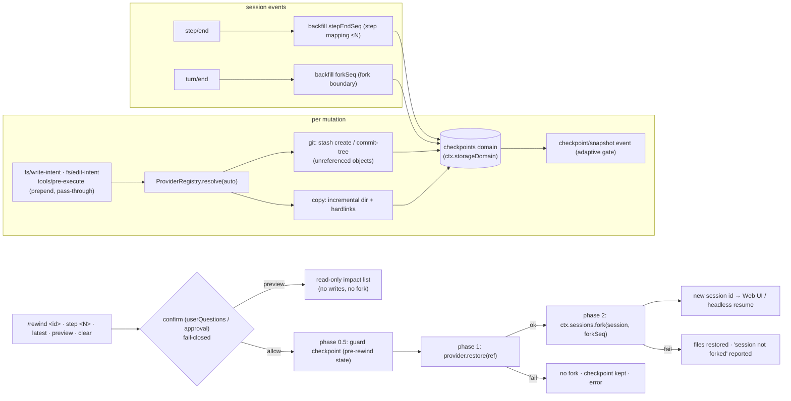

# dsh-checkpoint-rewind

**English** · [中文](README.zh.md) · [Español](README.es.md) · [Português](README.pt.md) · [हिन्दी](README.hi.md)

**Claude Code `/rewind`, done right for DeepSeek Harness.**

A capability-seam plugin that adds **workspace file snapshots + session-boundary rollback** to [DeepSeek Harness](https://github.com/deepseek-ai/deepseek-harness): before every mutating tool execution the plugin captures your workspace (git-first, copy fallback), and one `/rewind` command restores the files **and** forks the session back to the checkpoint's turn boundary — so the model context and the files on disk always agree.

[](LICENSE)
[](https://www.npmjs.com/package/dsh-checkpoint-rewind)
[](https://www.npmjs.com/package/dsh-checkpoint-rewind)
[](https://github.com/PerryLink/dsh-checkpoint-rewind/actions/workflows/ci.yml)
[](#)
[](#)

> **Topics**: `dsh` · `dsh-plugin` · `deepseek-harness` · `rewind` · `checkpoint` · `snapshot` · `session-fork` · `workspace-safety` · `undo` · `cordis-plugin`

**TL;DR**

- 📸 **Snapshot before every mutation** — every write path (`write`, `edit`, `str_replace_editor`, `bash`, `pwsh`, `terminal_send`, …) is captured first, silently, via `fs/*-intent` + `tools/pre-execute` pass-through listeners.
- 🧵 **git-first, no history risk** — snapshots are unreferenced git objects (`stash create` / `commit-tree`); restore is worktree-only and path-explicit, so files created after the checkpoint are **never deleted**. Non-git directories fall back to incremental directory snapshots.
- ⏪ **One command to go back** — `/rewind` lists checkpoints; `/rewind <id-prefix>` / `step <N>` / `latest` confirms, restores files, then forks the session at the checkpoint's turn boundary and returns the new session id.
- 🔍 **Preview before you leap** — `/rewind preview <target>` prints the exact impact (files that would be overwritten, files created after the checkpoint that stay) without touching anything — no confirmation prompt, no writes, no fork.
- 🛡️ **Rewind is itself reversible** — a guard checkpoint of the pre-rewind state is captured first, so `/rewind <guard-id>` undoes the rewind.
- 🔒 **Fail-closed by design** — restore requires human confirmation; no answerer means no restore. No `git reset --hard`, no `git clean`, no message-level editing, no writes through symbolic links, ever.

---

## Why another rewind plugin?

| Plugin | What it sells | Restores files? | Rewinds the session? |
|---|---|---|---|
| **dsh-checkpoint-rewind** (this) | git-object snapshots + turn-boundary fork + one-shot restore | ✅ full workspace state | ✅ fork-seeded child session |
| [Anionex/dsh-turn-rewind](https://github.com/Anionex/dsh-turn-rewind) | persistent Change Ledger of per-mutation deltas | ✅ by replaying inverse deltas | ✅ its own ledger model |
| [LingLambda/dsh-undo](https://github.com/LingLambda/dsh-undo) | pure context rollback to the last completed step | ❌ | ✅ context only |
| [Mongfayi/dsh-recall](https://github.com/Mongfayi/dsh-recall) | message recall (remove a turn and everything after) | ❌ (explicitly) | ✅ turn removal |

The difference in one sentence: **dsh-checkpoint-rewind captures the *workspace state* with side-effect-free git primitives before each mutation and makes "back to step N" one approved command — guard checkpoint first, files restored second, session forked third, each phase logged.** No delta bookkeeping to drift, no message-level editing (that belongs to a different plugin), no cross-device sync.

## Features

- **Snapshots before every mutation** — a prepend pass-through listener on `fs/write-intent` / `fs/edit-intent` plus `tools/pre-execute` for non-fs mutators (`bash`, `pwsh`, `terminal_send`, …), so *every* change path is covered without stealing the policy decision slot.
- **Provider seam** — `git` first: `git stash create` / `git commit-tree` produce unreferenced snapshot objects that **never touch your worktree, index, or history**; restore is worktree-only and restores **explicit paths only** — `git restore … -- .` would delete files `git add`-ed after the checkpoint, so the provider never emits it. Unborn-HEAD repos are detected and degrade to `copy`; availability probes are cached per workspace. Non-git directories use `copy` (incremental directory snapshots with hardlink reuse), clearly labeled in the list.
- **Step-level mapping, turn-level forks** — every checkpoint records its turn/step; `step/end` backfills the step mapping ("back to step N" = nearest snapshot ≤ N, reachable via `/rewind step <N>`), and `turn/end` backfills the fork boundary, using the harness's real `ctx.sessions.fork` primitive.
- **Three-phase rewind transaction** — `/rewind <id>` asks for confirmation (userQuestions / approval seam, **fail-closed when no answerer**), captures a **guard checkpoint** of the current state (config `preRewindCheckpoint`), restores files second, then forks third; a restore failure never forks, a fork failure reports "files restored, session not forked" — and the guard checkpoint makes the whole rewind undoable.
- **Read-only impact preview** — `/rewind preview <target>` (same addressing: id prefix, `step <N>`, `latest`) shows exactly which files a restore would overwrite and which post-checkpoint files would stay, without the confirmation gate, without writes, and without a fork — informed approval instead of a leap of faith.
- **Durable registry + quotas** — checkpoint records live in `ctx.storageDomain` (domain `checkpoints`; SQLite backend = rows, JSON backend = a human-readable file); `maxSnapshots` (per session, default 50) and `maxSnapshotBytes` (global **incremental-byte** soft quota, default 512 MiB; the newest checkpoint per session is always retained, so large workspaces never self-prune), `pruneOnTurnEnd`, oldest-first.
- **Copy integrity option** — `verifyByHash` makes the copy provider compare content hashes instead of size+mtime (a `touch -r`/`rsync -t` exact-mtime restore cannot hide a same-size content change) and verify restored content; file modes are restored on a best-effort basis.
- **Reconstructable by design** — `/rewind` output rides the harness's own `command/run` + `command/done` events; `checkpoint/snapshot|bound|prune|rewind` session events are appended whenever the host knows the types **or** supports the `ignorable` envelope (runtime probe; rc.6 adaptive gate stays closed and safe).
- **Web-ready projection** — a session-projection unit `checkpoints` is registered whenever `ctx.sessionProjections` exists (via `ctx.inject`), so a shell panel can render the checkpoint strip from the event log with zero plugin changes.
- **Model-aware rewind** — the forked child session receives an injected notice (`user/message`, plugin source) naming the checkpoint, the restore, and the guard checkpoint, so the resumed model never continues from stale tool results.

## Compatibility

| Requirement | Status | Last verified |
|---|---|---|
| DeepSeek Harness `0.1.0-rc.6` (npm `next`) | ✅ load-level verified | 2026-08-14 (`dsh 0.1.0-rc.6`, tarball install → `dsh --profile headless --dump-config` shows the layer; headless run reaches only the credential stage) |
| Node `^22.19 \|\| >=24` | ✅ CI matrix | 2026-08-14 |
| `git` | optional | only for the git provider; non-git directories and unborn-HEAD repos degrade to `copy` automatically |

## Quick start

`dsh-checkpoint-rewind` ships as a **bundle plugin** — the published package *is* the source (`index.mjs` + `lib/`, pure ESM), so there is no build step and no `src/` directory; `dsh.bundle.patch` in `package.json` points at the root `cordis.patch.yml`.

```sh
dsh plugin --profile <profile> add dsh-checkpoint-rewind    # standard Profile Bundle install (npm)
# restart dsh — done. /rewind is live in the Web UI.
```

Or mount it directly for experiments:

```sh
pnpm dsh web --patch ./cordis.patch.yml
```

Uninstall (removes the command and listeners; snapshot files stay until you delete them):

```sh
dsh plugin --profile <name> remove dsh-checkpoint-rewind
rm -rf "$DSH_HOME/dsh-checkpoint-rewind"   # copy-provider snapshots; git objects are garbage-collected
```

Workspace mutations now create checkpoints automatically. In the Web UI (or any interactive adapter):

```text
/rewind
```

```text
rewind: 3 checkpoints (newest last):
#a1b2c3d4 · (git) · turn 2 step 1 · 2026-08-14 12:00:01 (3 min ago) · trigger: bash · 4 files · 1.2 MiB · fork: ready
#b2c3d4e5 · (git) · turn 2 step 3 · 2026-08-14 12:00:41 · trigger: str_replace_editor · 2 files · 310 KiB · fork: ready
#c3d4e5f6 · (copy) · turn 3 step 1 · 2026-08-14 12:01:10 · trigger: write · 1 file · 90 KiB · fork: pending (turn not closed)
run "/rewind <id>" to restore files and fork the session from that checkpoint
```

Address a checkpoint by its unique id prefix (the short id shown in the list works), by step number, or by `latest`:

```text
/rewind b2c3d4e5
/rewind step 2
/rewind latest
/rewind preview b2c3d4e5   # read-only: show which files would change, touch nothing
/rewind clear        # confirmed deletion of this session's checkpoints (files untouched)
```

`preview` resolves through the same addressing (`<id-prefix>`, `step <N>`, `latest`) and prints the impact without asking for confirmation or writing anything:

```text
rewind preview: checkpoint #b2c3d4e5-… (provider git, turn 2 step 3)
restoring it would overwrite 2 file(s):
  src/app.ts
  src/util.ts
3 file(s) already match the checkpoint (not touched).
no files are deleted: 1 file(s) created after the checkpoint would be left in place:
  src/new.ts
run "/rewind <id>" to confirm and apply (a guard checkpoint is captured first)
```

The plugin asks **"Restore the workspace files to this checkpoint and fork the session?"** → on approval it captures a guard checkpoint, restores the files, forks the session at the checkpoint's turn boundary, and returns the new session id:

```text
rewind: restored 2 file(s) from checkpoint b2c3d4e5-… (provider git)
and forked a new session at seq 87 (end of turn 2).
session: session-123
Open the new session to continue from before that turn; this session keeps its later history.
rewind guard: f6a7b8c9-… (run "/rewind f6a7b8c9" to undo this rewind)
```

Headless runs print the same result with resume guidance; the Web shell can use the returned `session:` id to navigate (see [Web UI](#web-ui-anchor)).

## Demo

A real assembled-headless run (`npm run test:integration`): the agent modifies `a.txt` in turn 1 and `b.txt` in turn 2, creates `c.txt` afterwards, then a `/rewind preview` inspects the impact read-only and a `/rewind` restores both files and forks the session. (Transcript is verbatim output; note the incremental byte accounting: the second checkpoint costs only the changed file — and the preview line prompts no confirmation and writes nothing.)

```console
[rewind-integration] copy flow: mounted; workspace C:\Users\me\Temp\dsh-rewind-int-ws-NTk6jw
[rewind-integration]   /rewind list:
    rewind: 2 checkpoints (newest last):
    #9ab2d753 · (copy) · turn 1 step 1 · 2026/8/15 12:57:05 (just now) · trigger: fs/write-intent · 2 files · 10 B · fork: ready
    #7ec0e96f · (copy) · turn 2 step 1 · 2026/8/15 12:57:05 (just now) · trigger: fs/write-intent · 2 files · 6 B · fork: ready
    run "/rewind <id>" to restore files and fork the session from that checkpoint
[rewind-integration]   /rewind preview ok (no gate, no writes): rewind preview: checkpoint #9ab2d753-… (provider copy, turn 1 step 1)
[rewind-integration]   [user-questions] asked: Restore the workspace files to this checkpoint and fork the session?
[rewind-integration]   /rewind result: rewind: restored 2 file(s) from checkpoint 9ab2d753-… (provider copy)
and forked a new session at seq 3 (end of turn 1).
session: session-1
Open the new session to continue from before that turn; this session keeps its later history.
1 file(s) created after the checkpoint were left in place (overwrite rollback never deletes files)
rewind guard: f18027ea-… (run "/rewind f18027ea" to undo this rewind)
[rewind-integration]   fork ok: child session-1 seedLength 4 parent integration-session
[rewind-integration] copy flow: PASS
[rewind-integration] git flow: mounted; workspace C:\Users\me\Temp\dsh-rewind-int-git-CXd4BQ
[rewind-integration]   /rewind preview ok (git): rewind preview: checkpoint #fd1dc3ad-… (provider git, turn 1 step 1)
[rewind-integration]   [user-questions] asked: Restore the workspace files to this checkpoint and fork the session?
[rewind-integration]   git restore ok; HEAD intact: 19484e99
[rewind-integration] git flow: PASS
[rewind-integration] integration: ALL PASS
```

## Configuration

Everything is a `Config` field (cordis.yml can change it; nothing is hardcoded):

| Key | Default | Meaning |
|---|---:|---|
| `enabled` | `true` | Master switch; `false` removes the command, listeners, and providers entirely. |
| `provider` | `auto` | Snapshot provider: `auto` (git if available, else copy) · `git` (fail loud on non-git dirs) · `copy`. |
| `gitBin` | `git` | Git executable path. |
| `snapshotDir` | `$DSH_HOME/dsh-checkpoint-rewind` | Root for copy-provider snapshots. |
| `maxSnapshots` | `50` | Checkpoints kept **per session** (oldest pruned first). |
| `maxSnapshotBytes` | `536870912` (512 MiB) | Global **incremental-byte** soft quota across all sessions (oldest pruned first; the newest checkpoint per session is always retained). |
| `pruneOnTurnEnd` | `true` | Run quota pruning when a turn ends. |
| `mutationTools` | `['bash','write','edit','str_replace_editor','pwsh','terminal_send']` | Tools treated as mutating at `tools/pre-execute` (fs tools are covered by `fs/*-intent` regardless). |
| `excludeGlobs` | `['node_modules','.git','.dsh','dist','build']` | Glob patterns skipped by the copy provider: `*` within a segment, `?` single char, `**` across segments; a pattern without `/` matches a segment name at any depth, a pattern with `/` matches relative paths, and a matching directory excludes its whole subtree (`.git` and the snapshot dir are always excluded). |
| `confirmVia` | `auto` | Confirmation channel: `auto` (userQuestions first, then approval) · `userQuestions` · `approval`. Note: `approval` requires an open turn and commands run between turns, so on rc.6 it fails closed with an actionable message — mount userQuestions. |
| `listLimit` | `10` | Checkpoints shown by bare `/rewind`. |
| `preRewindCheckpoint` | `warn` | Guard checkpoint before restore: `warn` (warn and continue on capture failure) · `require` (abort the rewind) · `off`. |
| `verifyByHash` | `false` | Copy-provider content-hash comparison and restore verification (slower; closes the size+mtime quick-check blind spot). |

```yaml
- insert:
    - id: checkpoint-rewind
      name: dsh-checkpoint-rewind
      config:
        provider: auto
        maxSnapshots: 50
        maxSnapshotBytes: 536870912
        pruneOnTurnEnd: true
        confirmVia: auto
        preRewindCheckpoint: warn
```

## Safety model

- **Git history is untouchable.** The git provider runs only whitelisted side-effect-free primitives — `stash create`, `commit-tree`, `restore --worktree`, `ls-tree`, `diff-tree`, `ls-files`, `status`, `rev-parse` — enforced by a runtime assertion, and object refs are validated as hex ids before being passed to git (a tampered record cannot inject git options). **No `reset --hard`, no `clean`, no index/history mutation, ever.**
- **Overwrite rollback, never deletion.** Restore only overwrites captured files, and the git provider restores **explicit paths** (`git restore … -- .` would delete files `git add`-ed after the checkpoint). Files created after the checkpoint (untracked **or** staged) are *reported* and left in place.
- **No writes through links, no path traversal.** The copy provider validates checkpoint refs before joining them into snapshot-directory paths, and refuses to restore through a destination (or ancestor) that has become a symbolic link — and refuses to read a snapshot-storage file that has become one — so a restore can never follow a link out of the workspace. Snapshot refs and git object ids are format-checked at the persistence boundary.
- **Restore requires approval.** Overwriting user files always goes through the confirmation seam with `ask` semantics; a missing, throwing, or answering-no answerer **fails closed**. `/rewind preview` is the read-only way to inspect the impact first.
- **Rewind is reversible.** Before restoring, a guard checkpoint captures the current state; restoring the guard undoes the rewind. `preRewindCheckpoint: require` aborts the rewind when the guard cannot be captured.
- **Three-phase transaction, fixed order.** Guard first, files second, fork third; every phase is logged; a failed restore leaves files, checkpoints, and session untouched.
- **Model-visible ⟺ logged.** Everything a user or model sees is reconstructable from the session log (`command/run` + `command/done` and, once the host knows them, `checkpoint/*` events) plus the durable `checkpoints` domain.

## How it works

`checkpoint/snapshot` (creation) → `checkpoint/bound` (step/end and turn/end backfill) → `/rewind` (list / confirm / guard / restore / fork):



Full decision record, event vocabulary, and the provider seam contract: [ARCHITECTURE.md](ARCHITECTURE.md).

## Session events (rc.6 note)

The plugin declares `checkpoint/snapshot`, `checkpoint/bound`, `checkpoint/prune`, and `checkpoint/rewind` as log-only `SessionEventMap` members. Harness rc.6 has **no plugin event-registration surface** and `Session.append` silently drops unknown option keys, so appending unknown types would make the session unreadable on reload. The plugin therefore appends through an **adaptive gate**: a runtime probe (on a detached, never-persisted session store) detects whether the host's `append` stamps the `ignorable` envelope — on rc.6 the gate stays closed; on hosts that support it, `checkpoint/*` events are appended with `ignorable: true` automatically. Until then the authoritative audit chain is `command/run` + `command/done` (harness-known) plus the durable `checkpoints` storage domain.

## Web UI anchor

The plugin returns the new session id in the command result (`session: <id>`) and the Web shell can navigate there. The **session-projection unit `checkpoints` is shipped**: whenever `ctx.sessionProjections` exists, the plugin registers the unit via `ctx.inject` (folds `checkpoint/snapshot|bound|prune|rewind` into a whole-value list, `stateVersion` 0) — it stays an empty list on rc.6 hosts until a harness build ships the `checkpoint/*` vocabulary or the `ignorable` envelope, then fills in with zero plugin changes. What remains a shell-side follow-up: the **read-only panel** rendering that projection (see [ARCHITECTURE.md](ARCHITECTURE.md#todo-web-ui-checkpoint-strip)).

## FAQ

**Does this replace git?** No — it *uses* git where available. In a git repo you get byte-perfect, deduplicated snapshot objects without touching history; in any other directory the copy provider does the same with plain files. Regular commits remain your long-term history.

**Why not `git reset --hard`?** Because destroying state is not the job of a safety net. The plugin only creates unreferenced objects and performs worktree-only, path-explicit restores, so a bad rewind can never lose history, the index, or files created after the checkpoint.

**Can I rewind to a step in the middle of a turn?** File restoration is step-precise (`/rewind step <N>` = nearest snapshot ≤ N). The session fork, however, respects the harness's fork granularity: the child session ends at the checkpoint's `turn/end`, because `ctx.sessions.fork` rejects prefixes inside an open turn. Files and conversation stay consistent at that boundary.

**What happens if nobody can answer the confirmation?** Nothing is touched — the plugin fails closed (`unavailable`/`rejected`), keeps the checkpoint, and returns an explanatory error. With `confirmVia: approval` on rc.6 the message says to mount userQuestions, because approval requires an open turn and commands run between turns.

**Can I undo a rewind?** Yes — every approved rewind captures a guard checkpoint of the pre-rewind state first; the result prints `rewind guard: <id>`, and `/rewind <guard-id>` restores that state.

**How do I address checkpoints?** Unique id prefix (the 8-char short id in the list works), `/rewind step <N>`, `/rewind latest`, or `/rewind clear` to delete this session's checkpoints (files untouched). `/rewind preview <target>` uses the same addressing to show the impact without changing anything.

**What does `preview` do — and not do?** It resolves the checkpoint, then runs a read-only comparison: which files would be overwritten (or recreated), which already match, and which files created after the checkpoint would be left in place. It never prompts, never writes, never forks, and records no `checkpoint/rewind` event — the approval gate only runs on a real `/rewind <id>`.

## Tests

```sh
npm install
npm test                 # 160 unit tests (test/**/*.test.mjs, incl. provider suites):
                         # snapshot creation/dedup/concurrency, git & non-git paths, unborn-HEAD
                         # degradation, incremental-byte quotas + newest-retained floor, staged-file
                         # restore safety, ≤N boundary mapping, three-phase failure matrix, approval
                         # rejection, addressing (prefix/step/latest/preview/clear), guard checkpoint
                         # modes, adaptive event gate + ignorable probe, hash verification, glob
                         # exclusion semantics, symlink/ref path-safety hardening, checkpoints
                         # projection unit (real Cordis + real SessionStore/CommandRuntime/
                         # SessionProjectionRegistry)
npm run test:integration # assembled-headless verification: agent modifies 2 files across 2 turns,
                         # /rewind list → preview (no gate, no writes) → restore → file contents +
                         # fork context + guard + post-checkpoint file survival asserted
```

## Troubleshooting

| Symptom | Cause / fix |
|---|---|
| `/rewind <id>` says `rewind cancelled: no confirmation answerer` | No userQuestions/approval channel is mounted — the plugin fails closed. Run in the Web UI (or mount a question provider); `confirmVia` selects the channel. |
| `/rewind <id>` says `approval requires an open turn …` | Commands run between turns and approval needs a turn — mount userQuestions or set `confirmVia: userQuestions`. |
| `rewind: checkpoint registry unavailable` | The `checkpoints` storage domain could not open (missing/erroring storage backend). Check the harness logs and the storage-domain backend config. |
| A checkpoint lists as `fork: pending (turn not closed)` | Its turn has no `turn/end` yet; files can still be restored, but the session fork waits for the turn to close. |
| `files restored … but the session was NOT forked` | Three-phase transaction, phase 2 failed (no closed boundary, or fork rejected). Files stay restored; use the printed `rewind guard: <id>` to undo — see the error reason in the result. |
| `rewind: aborted — the pre-rewind guard checkpoint could not be captured` | `preRewindCheckpoint: require` refused the rewind because the guard capture failed; fix the storage (or set `warn`/`off`). |
| A checkpoint lists as `(copy)` even though the directory is a repo | Unborn HEAD (no initial commit): git snapshot primitives require HEAD, so the plugin degrades to `copy` until the first commit. |
| `MISSING_CREDENTIAL` in headless runs | Unrelated to this plugin: no `DEEPSEEK_API_KEY` is configured for the model provider. |
| Snapshot storage grows | Pruning runs after every snapshot and at `turn/end` (`pruneOnTurnEnd`); lower `maxSnapshots` / `maxSnapshotBytes`, run `/rewind clear`, or delete `$DSH_HOME/dsh-checkpoint-rewind` after uninstalling. |

## Permissions & data

| Resource | Access |
|---|---|
| Workspace files | read for snapshots; written only by an approved `/rewind <id>` restore (overwrite, never deletion) |
| Snapshot storage | writes only under `snapshotDir` (default `$DSH_HOME/dsh-checkpoint-rewind/`) |
| Git repository | only whitelisted side-effect-free primitives (`stash create`, `commit-tree`, `restore --worktree` with explicit paths, …) — never `reset --hard`/`clean` |
| Session log | read for boundaries; appends log-only `checkpoint/*` events when the host knows them or supports the `ignorable` envelope |
| Network / credentials | none — fully local |

## Contributors

Thanks to everyone who has helped build this plugin:

- [PerryLink](https://github.com/PerryLink) — project author and maintainer: plugin architecture, git/copy providers, the three-phase rewind transaction, five-language docs, CI/CD, and the 0.1.0 → 0.4.0 releases.

No community contributors yet — your first PR could be listed here! See the [pull request template](.github/PULL_REQUEST_TEMPLATE.md) and the issue templates to get started.

## License

Apache License 2.0 — see [LICENSE](LICENSE), [THIRD_PARTY_NOTICES.md](THIRD_PARTY_NOTICES.md), and the security policy in [SECURITY.md](SECURITY.md).

## Related plugins

- **dsh-memento** — bounded, approval-gated cross-session memory (same plugin conventions).
- [Anionex/dsh-turn-rewind](https://github.com/Anionex/dsh-turn-rewind) · [LingLambda/dsh-undo](https://github.com/LingLambda/dsh-undo) — the alternatives this plugin differentiates from (table above).
