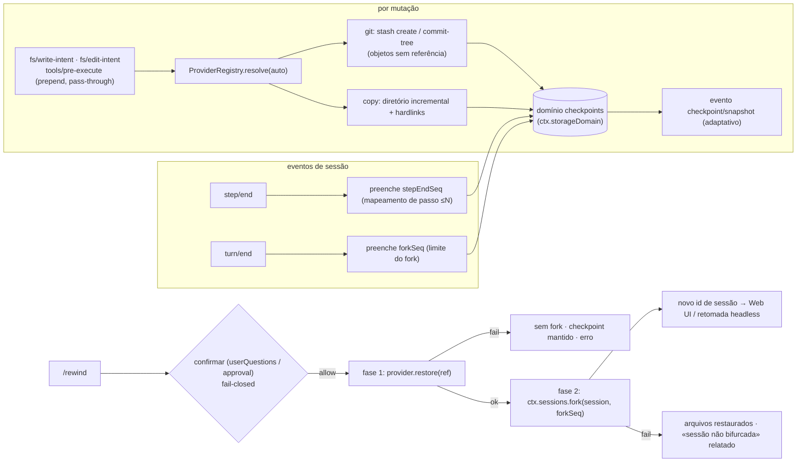

# dsh-checkpoint-rewind

[English](README.md) · [中文](README.zh.md) · [Español](README.es.md) · **Português** · [हिन्दी](README.hi.md)

**O `/rewind` do Claude Code, feito direito para o DeepSeek Harness.**

Um plugin de capability-seam que adiciona **snapshots de arquivos do workspace + retrocesso por limite de sessão** ao [DeepSeek Harness](https://github.com/deepseek-ai/deepseek-harness): antes de cada ferramenta mutadora o plugin captura o workspace (git primeiro, cópia como fallback) e um único comando `/rewind` restaura os arquivos **e** bifurca (fork) a sessão até o limite de turno do checkpoint — o contexto do modelo e os arquivos em disco sempre concordam.

[](LICENSE)
[](#)
[](#)
[](#testes)

> **Topics**: `dsh` · `dsh-plugin` · `deepseek-harness` · `rewind` · `checkpoint` · `session-fork` · `workspace-safety` · `undo` · `cordis-plugin`

**TL;DR**

- 📸 **Snapshot antes de cada mutação** — todos os caminhos de escrita (`write`, `edit`, `str_replace_editor`, `bash`, …) são capturados primeiro, silenciosamente, via listeners pass-through `fs/*-intent` + `tools/pre-execute`.
- 🧵 **git primeiro, sem risco histórico** — snapshots são objetos git sem referência (`stash create` / `commit-tree`); a restauração é somente-worktree. Diretórios sem git degradam para snapshots incrementais de diretório.
- ⏪ **Um comando para voltar** — `/rewind` lista checkpoints; `/rewind <id>` confirma, restaura arquivos, depois bifurca a sessão no limite de turno do checkpoint e devolve o id da nova sessão.
- 🔒 **Fail-closed por design** — restaurar exige confirmação humana; sem respondedor não há restauração. Nada de `git reset --hard`, nada de `git clean`, nunca edição de mensagens.

---

## Por que outro plugin de rewind?

| Plugin | O que vende | Restaura arquivos? | Retrocede a sessão? |
|---|---|---|---|
| **dsh-checkpoint-rewind** (este) | snapshots com objetos git + fork por turno + restauração em um passo | ✅ estado completo do workspace | ✅ sessão filha via fork |
| [Anionex/dsh-turn-rewind](https://github.com/Anionex/dsh-turn-rewind) | Change Ledger persistente de deltas por mutação | ✅ repetindo deltas inversos | ✅ modelo próprio de ledger |
| [LingLambda/dsh-undo](https://github.com/LingLambda/dsh-undo) | retrocesso só de contexto até o último passo concluído | ❌ | ✅ só contexto |
| [Mongfayi/dsh-recall](https://github.com/Mongfayi/dsh-recall) | retirada de mensagens (remove o turno e tudo depois) | ❌ (explicitamente) | ✅ remoção de turno |

A diferença em uma frase: **o dsh-checkpoint-rewind captura o *estado do workspace* com primitivas git sem efeitos colaterais antes de cada mutação e transforma «voltar ao passo N» em um comando aprovado — arquivos restaurados primeiro, sessão bifurcada depois, cada fase registrada.** Sem livro de deltas que dessincroniza, sem edição de mensagens (isso é outro plugin), sem sincronização entre dispositivos.

## Funcionalidades

- **Snapshots antes de cada mutação** — listener pass-through com `prepend` em `fs/write-intent` / `fs/edit-intent` mais `tools/pre-execute` para mutadores não-fs (`bash`, …), cobrindo *todos* os caminhos de mudança sem roubar o slot de decisão da política.
- **Provider seam** — `git` primeiro: `git stash create` / `git commit-tree` produzem objetos de snapshot sem referência que **nunca tocam worktree, índice ou histórico**; a restauração é `git restore` somente-worktree. Diretórios sem git degradam para `copy` (snapshots incrementais com hardlinks), claramente rotulados na lista.
- **Mapeamento por passo, forks por turno** — cada checkpoint registra seu turno/passo; `step/end` preenche o mapeamento de passos («voltar ao passo N» = snapshot mais próximo ≤ N) e `turn/end` preenche o limite do fork, usando o primitivo real `ctx.sessions.fork` do harness.
- **Transação de rewind em duas fases** — `/rewind <id>` pede confirmação (seam userQuestions / approval, **fail-closed sem respondedor**), restaura arquivos primeiro e então bifurca; falha de restauração nunca bifurca, falha de fork relata «arquivos restaurados, sessão não bifurcada» e mantém o checkpoint.
- **Registro durável + cotas** — os registros vivem em `ctx.storageDomain` (domínio `checkpoints`; backend SQLite = linhas, backend JSON = arquivo legível); `maxSnapshots` (por sessão, 50 por padrão), `maxSnapshotBytes` (global, 512 MiB por padrão), `pruneOnTurnEnd`, mais-antigo-primeiro.
- **Reconstruível por design** — a saída do `/rewind` trafega nos eventos próprios do harness `command/run` + `command/done`; os eventos `checkpoint/snapshot|bound|prune|rewind` estão declarados e são anexados automaticamente quando um build do host os conhecer (porta adaptativa rc.6).
- **Projeção pronta para a Web** — uma unidade de projeção de sessão `checkpoints` é registrada sempre que `ctx.sessionProjections` existir, de modo que um painel do shell pode renderizar a faixa de checkpoints a partir do log de eventos sem mudanças no plugin.
- **Rewind consciente do modelo** — a sessão filha bifurcada recebe um aviso injetado (`user/message`, fonte plugin) com o checkpoint e o escopo da restauração, para que o modelo retomado não continue com resultados de ferramentas obsoletos.

## Compatibilidade

| Requisito | Estado | Última verificação |
|---|---|---|
| DeepSeek Harness `0.1.0-rc.6` (npm `next`) | ✅ nível de carga verificado | 2026-08-14 (instalação via tarball → `dsh --profile headless --dump-config` mostra a camada; a execução só para na etapa de credenciais) |
| Node `^22.19 \|\| >=24` | ✅ matriz CI | 2026-08-14 |
| `git` | opcional | apenas para o provider git; diretórios sem git degradam para `copy` automaticamente |

## Início rápido

`dsh-checkpoint-rewind` é distribuído como **bundle plugin** (sem etapa de build, ESM puro):

```sh
dsh plugin add dsh-checkpoint-rewind    # entra na pilha de bundles do perfil
# reinicie o dsh — o /rewind já está ativo na Web UI.
```

Ou monte diretamente para experimentar:

```sh
pnpm dsh web --patch ./cordis.patch.yml
```

Desinstalar (remove o comando e os listeners; os snapshots persistem até você apagá-los):

```sh
dsh plugin --profile <name> remove dsh-checkpoint-rewind
rm -rf "$DSH_HOME/dsh-checkpoint-rewind"   # snapshots do provider copy; objetos git são coletados pelo gc
```

As mutações do workspace agora criam checkpoints automaticamente:

```text
/rewind
```

```text
rewind: 3 checkpoints (newest last):
#a1b2c3d4-e5f6-… · (git) · turn 2 step 1 · 2026-08-14 12:00:01 · trigger: bash · 4 files · 1.2 MiB · fork: ready
#b2c3d4e5-f6a7-… · (git) · turn 2 step 3 · 2026-08-14 12:00:41 · trigger: str_replace_editor · 2 files · 310 KiB · fork: ready
#c3d4e5f6-a7b8-… · (copy) · turn 3 step 1 · 2026-08-14 12:01:10 · trigger: write · 1 file · 90 KiB · fork: pending (turn not closed)
run "/rewind <id>" to restore files and fork the session from that checkpoint
```

```text
/rewind b2c3d4e5-f6a7-…
```

O plugin pergunta **«Restore the workspace files to this checkpoint and fork the session?»** → ao aprovar, restaura os arquivos, bifurca a sessão no limite de turno do checkpoint e devolve o id da nova sessão:

```text
rewind: restored 2 file(s) from checkpoint b2c3d4e5-f6a7-… (provider git)
and forked a new session at seq 87 (end of turn 2).
session: session-123
Open the new session to continue from before that turn; this session keeps its later history.
```

Execuções headless imprimem o mesmo resultado com orientação de retomada; o shell Web pode navegar usando o `session:` devolvido (veja [âncora Web UI](#âncora-web-ui)).

## Demo

Uma execução headless montada real (`npm run test:integration`): o agente modifica `a.txt` no turno 1 e `b.txt` no turno 2, depois um `/rewind` restaura ambos os arquivos e bifurca a sessão. (Transcrição literal.)

```console
[rewind-integration] copy flow: mounted; workspace C:\Users\me\Temp\dsh-rewind-int-ws-mpnQDg
[rewind-integration]   /rewind list:
    rewind: 2 checkpoints (newest last):
    #5889f233-6730-44dd-98dd-3b24cca09e77 · (copy) · turn 1 step 1 · 2026/8/14 04:30:18 · trigger: fs/write-intent · 2 files · 10 B · fork: ready
    #03fb9ea6-8b50-4284-b768-98d5acb155f0 · (copy) · turn 2 step 1 · 2026/8/14 04:30:18 · trigger: fs/write-intent · 2 files · 10 B · fork: ready
    run "/rewind <id>" to restore files and fork the session from that checkpoint
[rewind-integration]   [user-questions] asked: Restore the workspace files to this checkpoint and fork the session?
[rewind-integration]   /rewind result: rewind: restored 2 file(s) from checkpoint 5889f233-… (provider copy)
and forked a new session at seq 3 (end of turn 1).
session: session-1
Open the new session to continue from before that turn; this session keeps its later history.
[rewind-integration]   fork ok: child session-1 seedLength 4 parent integration-session
[rewind-integration] copy flow: PASS
[rewind-integration] git flow: mounted; workspace C:\Users\me\Temp\dsh-rewind-int-git-MhDhwe
[rewind-integration]   git restore ok; HEAD intact: 9c21ee5e
[rewind-integration] git flow: PASS
[rewind-integration] integration: ALL PASS
```

## Configuração

Tudo é um campo de `Config` (alterável via cordis.yml; nada é hardcoded):

| Chave | Padrão | Significado |
|---|---:|---|
| `enabled` | `true` | Chave mestra; `false` remove comando, listeners e providers. |
| `provider` | `auto` | Provider de snapshot: `auto` (git se disponível, senão copy) · `git` (falha alto em diretórios sem git) · `copy`. |
| `gitBin` | `git` | Caminho do executável git. |
| `snapshotDir` | `$DSH_HOME/dsh-checkpoint-rewind` | Raiz dos snapshots do provider copy. |
| `maxSnapshots` | `50` | Checkpoints mantidos **por sessão** (mais antigo podado primeiro). |
| `maxSnapshotBytes` | `536870912` (512 MiB) | Cota global de conteúdo entre sessões (mais antigo primeiro). |
| `pruneOnTurnEnd` | `true` | Executa a poda de cota ao fim de um turno. |
| `mutationTools` | `['bash','write','edit','str_replace_editor']` | Ferramentas tratadas como mutadoras em `tools/pre-execute` (as fs já são cobertas por `fs/*-intent`). |
| `excludeGlobs` | `['node_modules','.git','.dsh','dist','build']` | Diretórios/arquivos pulados pelo provider copy (`.git` e o diretório de snapshots são sempre excluídos). |
| `confirmVia` | `auto` | Canal de confirmação: `auto` (userQuestions primeiro, depois approval) · `userQuestions` · `approval`. |
| `listLimit` | `10` | Checkpoints mostrados pelo `/rewind` sem argumentos. |

```yaml
- insert:
    - id: checkpoint-rewind
      name: dsh-checkpoint-rewind
      config:
        provider: auto
        maxSnapshots: 50
        maxSnapshotBytes: 536870912
        pruneOnTurnEnd: true
        confirmVia: auto
```

## Modelo de segurança

- **O histórico do git é intocável.** O provider git só executa primitivas sem efeitos colaterais de uma whitelist — `stash create`, `commit-tree`, `restore --worktree`, `ls-tree`, `diff-tree`, `ls-files`, `status`, `rev-parse` — aplicada por asserção em runtime. **Nada de `reset --hard`, nada de `clean`, jamais mutar índice ou histórico.**
- **Restaurar exige aprovação.** Sobrescrever arquivos do usuário sempre passa pelo seam de confirmação com semântica `ask`; um respondedor ausente, que lança erro ou que nega **fecha em falso**.
- **Rollback por sobrescrita, nunca exclusão.** Ambos os providers restauram arquivos capturados e *relatam* arquivos criados depois do checkpoint (git: sem rastreamento; copy: extras do manifest) em vez de apagá-los.
- **Transação de duas fases, ordem fixa.** Arquivos primeiro, fork depois; cada fase é registrada; uma restauração falha deixa arquivos, checkpoints e sessão intactos.
- **Visível para o modelo ⟺ registrado.** Tudo o que usuários ou modelos veem é reconstruível a partir do log da sessão (`command/run` + `command/done` e, quando o host os conhecer, os eventos `checkpoint/*`) mais o domínio durável `checkpoints`.

## Como funciona

`checkpoint/snapshot` (criação) → `checkpoint/bound` (preenchimento de step/end e turn/end) → `/rewind` (listar / confirmar / restaurar em duas fases):



Registro completo de decisões, vocabulário de eventos e contrato do provider seam: [ARCHITECTURE.md](ARCHITECTURE.md).

## Eventos de sessão (nota rc.6)

O plugin declara `checkpoint/snapshot`, `checkpoint/bound`, `checkpoint/prune` e `checkpoint/rewind` como membros log-only de `SessionEventMap`. O harness rc.6 **não tem superfície de registro de eventos para plugins** e `Session.append` não consegue marcar tipos desconhecidos como `ignorable`, então anexá-los tornaria a sessão ilegível ao recarregar. O plugin anexa eventos por uma **porta adaptativa** (`KNOWN_SESSION_EVENT_TYPES`): hoje são pulados e passam a funcionar automaticamente quando um build do host incluir os tipos. Até lá, a cadeia de auditoria autoritativa é `command/run` + `command/done` (conhecidos do harness) mais o domínio durável `checkpoints`.

## Âncora Web UI

O plugin já devolve o id da nova sessão no resultado do comando (`session: <id>`) e o shell Web pode navegar até lá. A **unidade de projeção de sessão `checkpoints` já é distribuída**: quando `ctx.sessionProjections` existe, o plugin registra a unidade (dobra `checkpoint/snapshot|bound|prune|rewind` num valor de lista completa, `stateVersion` 0) — permanece uma lista vazia em hosts rc.6 até que um build do harness traga o vocabulário `checkpoint/*`, e então é preenchida sem mudanças no plugin. O acompanhamento restante é do shell: o **painel somente-leitura** que renderiza essa projeção (veja [ARCHITECTURE.md](ARCHITECTURE.md#todo-web-ui-checkpoint-strip)).

## FAQ

**Ele substitui o git?** Não — ele *usa* o git. Num repositório git você obtém objetos de snapshot byte-exatos e deduplicados sem tocar o histórico; em qualquer outro diretório o provider copy faz o mesmo com arquivos comuns. Seus commits habituais continuam sendo seu histórico de longo prazo.

**Por que não `git reset --hard`?** Porque destruir estado não é o trabalho de uma rede de segurança. O plugin só cria objetos sem referência e restaura apenas o worktree, então um rewind falho jamais perde histórico, índice ou arquivos criados depois do checkpoint.

**Posso voltar a um passo no meio de um turno?** A restauração de arquivos é precisa por passo (snapshot mais próximo ≤ N). O fork da sessão respeita a granularidade do harness: a sessão filha termina no `turn/end` do checkpoint, porque `ctx.sessions.fork` rejeita prefixos dentro de um turno aberto. Arquivos e conversa permanecem consistentes nesse limite.

**O que acontece se ninguém puder responder à confirmação?** Nada é tocado — o plugin fecha em falso (`unavailable`/`rejected`), mantém o checkpoint e devolve um erro explicativo.

## Testes

```sh
npm install
npm test                 # 60 testes unitários: criação/dedup/concorrência de snapshots, caminhos git e não-git,
                         # mapeamento de limite ≤N, cotas de poda, matriz de falhas de duas fases, rejeição de
                         # aprovação, porta adaptativa de eventos, unidade de projeção checkpoints
                         # (Cordis real + SessionStore/CommandRuntime/SessionProjectionRegistry reais)
npm run test:integration # verificação headless montada: o agente modifica 2 arquivos em 2 turnos,
                         # /rewind lista → restaura → conteúdos e contexto do fork assegurados
```

## Solução de problemas

| Sintoma | Causa / solução |
|---|---|
| `/rewind <id>` diz `rewind cancelled: no confirmation answerer` | Nenhum canal userQuestions/approval está montado — o plugin fecha em falso. Rode na Web UI (ou monte um provedor de perguntas); `confirmVia` escolhe o canal. |
| `rewind: checkpoint registry unavailable` | O domínio de armazenamento `checkpoints` não abriu (backend ausente/com erro). Veja os logs do harness e a rota do backend do domínio. |
| Um checkpoint mostra `fork: pending (turn not closed)` | O turno ainda não tem `turn/end`; os arquivos são restaurados, o fork espera o turno fechar. |
| `files restored … but the session was NOT forked` | Fase 2 da transação falhou (sem limite fechado ou fork rejeitado). Os arquivos ficam restaurados; o checkpoint e a sessão atual não são tocados — o resultado indica a razão. |
| `MISSING_CREDENTIAL` em headless | Não relacionado: falta `DEEPSEEK_API_KEY` para o provedor. |
| Armazenamento de snapshots cresce | A poda roda após cada snapshot e no `turn/end` (`pruneOnTurnEnd`); reduza `maxSnapshots`/`maxSnapshotBytes` ou apague `$DSH_HOME/dsh-checkpoint-rewind` após desinstalar. |

## Permissões e dados

| Recurso | Acesso |
|---|---|
| Arquivos do workspace | leitura para snapshots; escrita apenas numa restauração `/rewind <id>` aprovada (sobrescrita, nunca exclusão) |
| Armazenamento de snapshots | escreve apenas sob `snapshotDir` (padrão `$DSH_HOME/dsh-checkpoint-rewind/`) |
| Repositório git | apenas primitivas whitelisted sem efeitos colaterais (`stash create`, `commit-tree`, `restore --worktree`, …) — jamais `reset --hard`/`clean` |
| Log da sessão | leitura de limites; anexa eventos log-only `checkpoint/*` quando o host os conhece |
| Rede / credenciais | nenhuma — totalmente local |

## Licença

Apache License 2.0 — veja [LICENSE](LICENSE), [THIRD_PARTY_NOTICES.md](THIRD_PARTY_NOTICES.md) e a política de segurança em [SECURITY.md](SECURITY.md).

## Plugins relacionados

- **dsh-memento** — memória entre sessões limitada e com porta de aprovação (mesmas convenções de plugin).
- [Anionex/dsh-turn-rewind](https://github.com/Anionex/dsh-turn-rewind) · [LingLambda/dsh-undo](https://github.com/LingLambda/dsh-undo) — as alternativas das quais este plugin se diferencia (tabela acima).
