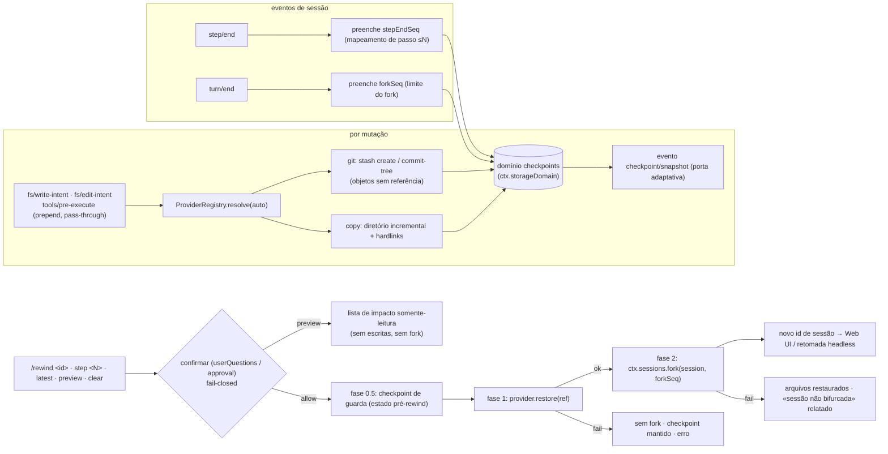

# dsh-checkpoint-rewind

[English](README.md) · [中文](README.zh.md) · [Español](README.es.md) · **Português** · [हिन्दी](README.hi.md)

**O `/rewind` do Claude Code, feito direito para o DeepSeek Harness.**

Um plugin de capability-seam que adiciona **snapshots de arquivos do workspace + retrocesso por limite de sessão** ao [DeepSeek Harness](https://github.com/deepseek-ai/deepseek-harness): antes de cada ferramenta mutadora o plugin captura o workspace (git primeiro, cópia como fallback) e um único comando `/rewind` restaura os arquivos **e** bifurca (fork) a sessão até o limite de turno do checkpoint — o contexto do modelo e os arquivos em disco sempre concordam.

[](LICENSE)
[](https://www.npmjs.com/package/dsh-checkpoint-rewind)
[](https://www.npmjs.com/package/dsh-checkpoint-rewind)
[](https://github.com/PerryLink/dsh-checkpoint-rewind/actions/workflows/ci.yml)
[](#)
[](#)

> **Topics**: `dsh` · `dsh-plugin` · `deepseek-harness` · `rewind` · `checkpoint` · `snapshot` · `session-fork` · `workspace-safety` · `undo` · `cordis-plugin`

**TL;DR**

- 📸 **Snapshot antes de cada mutação** — todos os caminhos de escrita (`write`, `edit`, `str_replace_editor`, `bash`, `pwsh`, `terminal_send`, …) são capturados primeiro, silenciosamente, via listeners pass-through `fs/*-intent` + `tools/pre-execute`.
- 🧵 **git primeiro, sem risco histórico** — snapshots são objetos git sem referência (`stash create` / `commit-tree`); a restauração é somente-worktree e restrita a caminhos explícitos, de modo que arquivos criados depois do checkpoint **nunca são apagados**. Diretórios sem git degradam para snapshots incrementais de diretório.
- ⏪ **Um comando para voltar** — `/rewind` lista checkpoints; `/rewind <id-prefixo>` / `step <N>` / `latest` confirma, restaura arquivos, depois bifurca a sessão no limite de turno do checkpoint e devolve o id da nova sessão.
- 🔍 **Pré-visualize antes de saltar** — `/rewind preview <target>` imprime o impacto exato (arquivos que seriam sobrescritos, arquivos criados depois do checkpoint que permanecem) sem tocar em nada — sem prompt de confirmação, sem escritas, sem fork.
- 🛡️ **O rewind em si é reversível** — um checkpoint de guarda do estado pré-rewind é capturado primeiro, então `/rewind <guard-id>` desfaz o rewind.
- 🔒 **Fail-closed por design** — restaurar exige confirmação humana; sem respondedor não há restauração. Nada de `git reset --hard`, nada de `git clean`, nunca edição de mensagens, nunca escritas através de links simbólicos.

---

## Por que outro plugin de rewind?

| Plugin | O que vende | Restaura arquivos? | Retrocede a sessão? |
|---|---|---|---|
| **dsh-checkpoint-rewind** (este) | snapshots com objetos git + fork por turno + restauração em um passo | ✅ estado completo do workspace | ✅ sessão filha via fork |
| [Anionex/dsh-turn-rewind](https://github.com/Anionex/dsh-turn-rewind) | Change Ledger persistente de deltas por mutação | ✅ repetindo deltas inversos | ✅ modelo próprio de ledger |
| [LingLambda/dsh-undo](https://github.com/LingLambda/dsh-undo) | retrocesso só de contexto até o último passo concluído | ❌ | ✅ só contexto |
| [Mongfayi/dsh-recall](https://github.com/Mongfayi/dsh-recall) | retirada de mensagens (remove o turno e tudo depois) | ❌ (explicitamente) | ✅ remoção de turno |

A diferença em uma frase: **o dsh-checkpoint-rewind captura o *estado do workspace* com primitivas git sem efeitos colaterais antes de cada mutação e transforma «voltar ao passo N» em um comando aprovado — primeiro o checkpoint de guarda, depois os arquivos restaurados, por fim a sessão bifurcada, cada fase registrada.** Sem livro de deltas que dessincroniza, sem edição de mensagens (isso é outro plugin), sem sincronização entre dispositivos.

## Funcionalidades

- **Snapshots antes de cada mutação** — listener pass-through com `prepend` em `fs/write-intent` / `fs/edit-intent` mais `tools/pre-execute` para mutadores não-fs (`bash`, `pwsh`, `terminal_send`, …), cobrindo *todos* os caminhos de mudança sem roubar o slot de decisão da política.
- **Provider seam** — `git` primeiro: `git stash create` / `git commit-tree` produzem objetos de snapshot sem referência que **nunca tocam worktree, índice ou histórico**; a restauração é somente-worktree e restaura **apenas caminhos explícitos** — `git restore … -- .` apagaria arquivos adicionados com `git add` depois do checkpoint, então o provider nunca o emite. Repositórios com HEAD não-nascido (unborn HEAD) são detectados e degradam para `copy`; sondas de disponibilidade são cacheadas por workspace. Diretórios sem git usam `copy` (snapshots incrementais de diretório com reúso de hardlinks), claramente rotulados na lista.
- **Mapeamento por passo, forks por turno** — cada checkpoint registra seu turno/passo; `step/end` preenche o mapeamento de passos («voltar ao passo N» = snapshot mais próximo ≤ N, acessível via `/rewind step <N>`) e `turn/end` preenche o limite do fork, usando o primitivo real `ctx.sessions.fork` do harness.
- **Transação de rewind em três fases** — `/rewind <id>` pede confirmação (seam userQuestions / approval, **fail-closed sem respondedor**), captura um **checkpoint de guarda** do estado atual (config `preRewindCheckpoint`), restaura os arquivos em segundo e bifurca em terceiro; falha de restauração nunca bifurca, falha de fork relata «arquivos restaurados, sessão não bifurcada» — e o checkpoint de guarda torna todo o rewind desfazível.
- **Pré-visualização de impacto somente-leitura** — `/rewind preview <target>` (mesmo endereçamento: prefixo de id, `step <N>`, `latest`) mostra exatamente quais arquivos uma restauração sobrescreveria e quais arquivos pós-checkpoint permaneceriam, sem a porta de confirmação, sem escritas e sem fork — aprovação informada em vez de um salto de fé.
- **Registro durável + cotas** — os registros de checkpoint vivem em `ctx.storageDomain` (domínio `checkpoints`; backend SQLite = linhas, backend JSON = arquivo legível); `maxSnapshots` (por sessão, padrão 50) e `maxSnapshotBytes` (cota suave global de **bytes incrementais**, padrão 512 MiB; o checkpoint mais novo de cada sessão é sempre retido, então workspaces grandes nunca se auto-podam), `pruneOnTurnEnd`, mais-antigo-primeiro.
- **Opção de integridade de cópia** — `verifyByHash` faz o provider copy comparar hashes de conteúdo em vez de size+mtime (uma restauração com mtime exato via `touch -r`/`rsync -t` não esconde uma mudança de conteúdo de mesmo tamanho) e verifica o conteúdo restaurado; modos de arquivo são restaurados em base best-effort.
- **Reconstruível por design** — a saída do `/rewind` trafega nos eventos próprios do harness `command/run` + `command/done`; os eventos de sessão `checkpoint/snapshot|bound|prune|rewind` são anexados sempre que o host conhece os tipos **ou** suporta o envelope `ignorable` (sonda em runtime; a porta adaptativa do rc.6 permanece fechada e segura).
- **Projeção pronta para a Web** — uma unidade de projeção de sessão `checkpoints` é registrada sempre que `ctx.sessionProjections` existir (via `ctx.inject`), de modo que um painel do shell pode renderizar a faixa de checkpoints a partir do log de eventos sem mudanças no plugin.
- **Rewind consciente do modelo** — a sessão filha bifurcada recebe um aviso injetado (`user/message`, fonte plugin) nomeando o checkpoint, a restauração e o checkpoint de guarda, para que o modelo retomado nunca continue com resultados de ferramentas obsoletos.

## Compatibilidade

| Requisito | Estado | Última verificação |
|---|---|---|
| DeepSeek Harness `0.1.0-rc.6` (npm `next`) | ✅ nível de carga verificado | 2026-08-14 (instalação via tarball → `dsh --profile headless --dump-config` mostra a camada; a execução só para na etapa de credenciais) |
| Node `^22.19 \|\| >=24` | ✅ matriz CI | 2026-08-14 |
| `git` | opcional | apenas para o provider git; diretórios sem git e repositórios com unborn HEAD degradam para `copy` automaticamente |

## Início rápido

`dsh-checkpoint-rewind` é distribuído como **bundle plugin** — o pacote publicado *é* o código-fonte (`index.mjs` + `lib/`, ESM puro), então não há etapa de build nem diretório `src/`; `dsh.bundle.patch` no `package.json` aponta para o `cordis.patch.yml` da raiz.

```sh
dsh plugin --profile <profile> add dsh-checkpoint-rewind    # instalação padrão Profile Bundle (npm)
# reinicie o dsh — o /rewind já está ativo na Web UI.
```

Ou monte diretamente para experimentar:

```sh
pnpm dsh web --patch ./cordis.patch.yml
```

Desinstalar (remove o comando e os listeners; os snapshots persistem até você apagá-los):

```sh
dsh plugin --profile <name> remove dsh-checkpoint-rewind
rm -rf "$DSH_HOME/dsh-checkpoint-rewind"   # snapshots do provider copy; objetos git são coletados pelo gc
```

As mutações do workspace agora criam checkpoints automaticamente. Na Web UI (ou em qualquer adaptador interativo):

```text
/rewind
```

```text
rewind: 3 checkpoints (newest last):
#a1b2c3d4 · (git) · turn 2 step 1 · 2026-08-14 12:00:01 (3 min ago) · trigger: bash · 4 files · 1.2 MiB · fork: ready
#b2c3d4e5 · (git) · turn 2 step 3 · 2026-08-14 12:00:41 · trigger: str_replace_editor · 2 files · 310 KiB · fork: ready
#c3d4e5f6 · (copy) · turn 3 step 1 · 2026-08-14 12:01:10 · trigger: write · 1 file · 90 KiB · fork: pending (turn not closed)
run "/rewind <id>" to restore files and fork the session from that checkpoint
```

Enderece um checkpoint pelo prefixo único do id (o id curto mostrado na lista funciona), pelo número do passo ou por `latest`:

```text
/rewind b2c3d4e5
/rewind step 2
/rewind latest
/rewind preview b2c3d4e5   # somente-leitura: mostra quais arquivos mudariam, não toca em nada
/rewind clear        # exclusão confirmada dos checkpoints desta sessão (arquivos intactos)
```

`preview` resolve pelo mesmo endereçamento (`<id-prefixo>`, `step <N>`, `latest`) e imprime o impacto sem pedir confirmação nem escrever nada:

```text
rewind preview: checkpoint #b2c3d4e5-… (provider git, turn 2 step 3)
restoring it would overwrite 2 file(s):
  src/app.ts
  src/util.ts
3 file(s) already match the checkpoint (not touched).
no files are deleted: 1 file(s) created after the checkpoint would be left in place:
  src/new.ts
run "/rewind <id>" to confirm and apply (a guard checkpoint is captured first)
```

O plugin pergunta **«Restore the workspace files to this checkpoint and fork the session?»** → ao aprovar, captura um checkpoint de guarda, restaura os arquivos, bifurca a sessão no limite de turno do checkpoint e devolve o id da nova sessão:

```text
rewind: restored 2 file(s) from checkpoint b2c3d4e5-… (provider git)
and forked a new session at seq 87 (end of turn 2).
session: session-123
Open the new session to continue from before that turn; this session keeps its later history.
rewind guard: f6a7b8c9-… (run "/rewind f6a7b8c9" to undo this rewind)
```

Execuções headless imprimem o mesmo resultado com orientação de retomada; o shell Web pode navegar usando o `session:` devolvido (veja [Âncora Web UI](#âncora-web-ui)).

## Demo

Uma execução headless montada real (`npm run test:integration`): o agente modifica `a.txt` no turno 1 e `b.txt` no turno 2, cria `c.txt` depois, então um `/rewind preview` inspeciona o impacto em somente-leitura e um `/rewind` restaura ambos os arquivos e bifurca a sessão. (Transcrição literal; note a contabilização incremental de bytes: o segundo checkpoint custa apenas o arquivo alterado — e a linha preview não pede confirmação nem escreve nada.)

```console
[rewind-integration] copy flow: mounted; workspace C:\Users\me\Temp\dsh-rewind-int-ws-NTk6jw
[rewind-integration]   /rewind list:
    rewind: 2 checkpoints (newest last):
    #9ab2d753 · (copy) · turn 1 step 1 · 2026/8/15 12:57:05 (just now) · trigger: fs/write-intent · 2 files · 10 B · fork: ready
    #7ec0e96f · (copy) · turn 2 step 1 · 2026/8/15 12:57:05 (just now) · trigger: fs/write-intent · 2 files · 6 B · fork: ready
    run "/rewind <id>" to restore files and fork the session from that checkpoint
[rewind-integration]   /rewind preview ok (no gate, no writes): rewind preview: checkpoint #9ab2d753-… (provider copy, turn 1 step 1)
[rewind-integration]   [user-questions] asked: Restore the workspace files to this checkpoint and fork the session?
[rewind-integration]   /rewind result: rewind: restored 2 file(s) from checkpoint 9ab2d753-… (provider copy)
and forked a new session at seq 3 (end of turn 1).
session: session-1
Open the new session to continue from before that turn; this session keeps its later history.
1 file(s) created after the checkpoint were left in place (overwrite rollback never deletes files)
rewind guard: f18027ea-… (run "/rewind f18027ea" to undo this rewind)
[rewind-integration]   fork ok: child session-1 seedLength 4 parent integration-session
[rewind-integration] copy flow: PASS
[rewind-integration] git flow: mounted; workspace C:\Users\me\Temp\dsh-rewind-int-git-CXd4BQ
[rewind-integration]   /rewind preview ok (git): rewind preview: checkpoint #fd1dc3ad-… (provider git, turn 1 step 1)
[rewind-integration]   [user-questions] asked: Restore the workspace files to this checkpoint and fork the session?
[rewind-integration]   git restore ok; HEAD intact: 19484e99
[rewind-integration] git flow: PASS
[rewind-integration] integration: ALL PASS
```

## Configuração

Tudo é um campo de `Config` (alterável via cordis.yml; nada é hardcoded):

| Chave | Padrão | Significado |
|---|---:|---|
| `enabled` | `true` | Chave mestra; `false` remove comando, listeners e providers. |
| `provider` | `auto` | Provider de snapshot: `auto` (git se disponível, senão copy) · `git` (falha alto em diretórios sem git) · `copy`. |
| `gitBin` | `git` | Caminho do executável git. |
| `snapshotDir` | `$DSH_HOME/dsh-checkpoint-rewind` | Raiz dos snapshots do provider copy. |
| `maxSnapshots` | `50` | Checkpoints mantidos **por sessão** (mais antigo podado primeiro). |
| `maxSnapshotBytes` | `536870912` (512 MiB) | Cota suave global de **bytes incrementais** entre todas as sessões (mais antigo podado primeiro; o checkpoint mais novo de cada sessão é sempre retido). |
| `pruneOnTurnEnd` | `true` | Executa a poda de cota ao fim de um turno. |
| `mutationTools` | `['bash','write','edit','str_replace_editor','pwsh','terminal_send']` | Ferramentas tratadas como mutadoras em `tools/pre-execute` (as fs já são cobertas por `fs/*-intent`). |
| `excludeGlobs` | `['node_modules','.git','.dsh','dist','build']` | Padrões glob pulados pelo provider copy: `*` dentro de um segmento, `?` um caractere, `**` entre segmentos; um padrão sem `/` coincide com o nome de um segmento em qualquer profundidade, um padrão com `/` coincide com caminhos relativos, e um diretório coincidente exclui toda a sua subárvore (`.git` e o diretório de snapshots são sempre excluídos). |
| `confirmVia` | `auto` | Canal de confirmação: `auto` (userQuestions primeiro, depois approval) · `userQuestions` · `approval`. Nota: `approval` exige um turno aberto e comandos rodam entre turnos, então no rc.6 ele fecha em falso com uma mensagem acionável — monte userQuestions. |
| `listLimit` | `10` | Checkpoints mostrados pelo `/rewind` sem argumentos. |
| `preRewindCheckpoint` | `warn` | Checkpoint de guarda antes da restauração: `warn` (avisa e continua em falha de captura) · `require` (aborta o rewind) · `off`. |
| `verifyByHash` | `false` | Comparação de hash de conteúdo e verificação de restauração do provider copy (mais lento; fecha o ponto cego da checagem rápida size+mtime). |

```yaml
- insert:
    - id: checkpoint-rewind
      name: dsh-checkpoint-rewind
      config:
        provider: auto
        maxSnapshots: 50
        maxSnapshotBytes: 536870912
        pruneOnTurnEnd: true
        confirmVia: auto
        preRewindCheckpoint: warn
```

## Modelo de segurança

- **O histórico do git é intocável.** O provider git só executa primitivas sem efeitos colaterais de uma whitelist — `stash create`, `commit-tree`, `restore --worktree`, `ls-tree`, `diff-tree`, `ls-files`, `status`, `rev-parse` — aplicada por asserção em runtime, e refs de objeto são validadas como ids hexadecimais antes de passadas ao git (um registro adulterado não pode injetar opções do git). **Nada de `reset --hard`, nada de `clean`, jamais mutar índice ou histórico.**
- **Rollback por sobrescrita, nunca exclusão.** A restauração apenas sobrescreve os arquivos capturados, e o provider git restaura **caminhos explícitos** (`git restore … -- .` apagaria arquivos adicionados com `git add` depois do checkpoint). Arquivos criados depois do checkpoint (sem rastreamento **ou** staged) são *relatados* e deixados no lugar.
- **Nada de escritas através de links, nada de path traversal.** O provider copy valida refs de checkpoint antes de juntá-las a caminhos do diretório de snapshots, e recusa restaurar através de um destino (ou ancestral) que tenha se tornado um link simbólico — e recusa ler um arquivo de armazenamento de snapshots que tenha se tornado um — então uma restauração nunca pode seguir um link para fora do workspace. Refs de snapshot e ids de objeto git são verificados por formato na fronteira de persistência.
- **Restaurar exige aprovação.** Sobrescrever arquivos do usuário sempre passa pelo seam de confirmação com semântica `ask`; um respondedor ausente, que lança erro ou que nega **fecha em falso**. `/rewind preview` é o caminho somente-leitura para inspecionar o impacto antes.
- **O rewind é reversível.** Antes de restaurar, um checkpoint de guarda captura o estado atual; restaurar a guarda desfaz o rewind. `preRewindCheckpoint: require` aborta o rewind quando a guarda não pode ser capturada.
- **Transação de três fases, ordem fixa.** Primeiro a guarda, depois os arquivos, por fim o fork; cada fase é registrada; uma restauração falha deixa arquivos, checkpoints e sessão intactos.
- **Visível para o modelo ⟺ registrado.** Tudo o que usuários ou modelos veem é reconstruível a partir do log da sessão (`command/run` + `command/done` e, quando o host os conhecer, os eventos `checkpoint/*`) mais o domínio durável `checkpoints`.

## Como funciona

`checkpoint/snapshot` (criação) → `checkpoint/bound` (preenchimento de step/end e turn/end) → `/rewind` (listar / confirmar / guarda / restaurar / fork):



Registro completo de decisões, vocabulário de eventos e contrato do provider seam: [ARCHITECTURE.md](ARCHITECTURE.md).

## Eventos de sessão (nota rc.6)

O plugin declara `checkpoint/snapshot`, `checkpoint/bound`, `checkpoint/prune` e `checkpoint/rewind` como membros log-only de `SessionEventMap`. O harness rc.6 **não tem superfície de registro de eventos para plugins** e `Session.append` descarta silenciosamente chaves de opção desconhecidas, então anexar tipos desconhecidos tornaria a sessão ilegível ao recarregar. O plugin, portanto, anexa por uma **porta adaptativa**: uma sonda em runtime (num session store destacado, nunca persistido) detecta se o `append` do host carimba o envelope `ignorable` — no rc.6 a porta permanece fechada; em hosts que o suportam, os eventos `checkpoint/*` são anexados com `ignorable: true` automaticamente. Até lá, a cadeia de auditoria autoritativa é `command/run` + `command/done` (conhecidos do harness) mais o domínio de armazenamento durável `checkpoints`.

## Âncora Web UI

O plugin devolve o id da nova sessão no resultado do comando (`session: <id>`) e o shell Web pode navegar até lá. A **unidade de projeção de sessão `checkpoints` é distribuída**: sempre que `ctx.sessionProjections` existir, o plugin registra a unidade via `ctx.inject` (dobra `checkpoint/snapshot|bound|prune|rewind` num valor de lista completa, `stateVersion` 0) — permanece uma lista vazia em hosts rc.6 até que um build do harness traga o vocabulário `checkpoint/*` ou o envelope `ignorable`, e então é preenchida sem mudanças no plugin. O acompanhamento restante é do shell: o **painel somente-leitura** que renderiza essa projeção (veja [ARCHITECTURE.md](ARCHITECTURE.md#todo-web-ui-checkpoint-strip)).

## FAQ

**Ele substitui o git?** Não — ele *usa* o git. Num repositório git você obtém objetos de snapshot byte-exatos e deduplicados sem tocar o histórico; em qualquer outro diretório o provider copy faz o mesmo com arquivos comuns. Seus commits habituais continuam sendo seu histórico de longo prazo.

**Por que não `git reset --hard`?** Porque destruir estado não é o trabalho de uma rede de segurança. O plugin só cria objetos sem referência e faz restaurações somente-worktree e de caminhos explícitos, então um rewind falho jamais perde histórico, o índice ou arquivos criados depois do checkpoint.

**Posso voltar a um passo no meio de um turno?** A restauração de arquivos é precisa por passo (`/rewind step <N>` = snapshot mais próximo ≤ N). O fork da sessão respeita a granularidade do harness: a sessão filha termina no `turn/end` do checkpoint, porque `ctx.sessions.fork` rejeita prefixos dentro de um turno aberto. Arquivos e conversa permanecem consistentes nesse limite.

**O que acontece se ninguém puder responder à confirmação?** Nada é tocado — o plugin fecha em falso (`unavailable`/`rejected`), mantém o checkpoint e devolve um erro explicativo. Com `confirmVia: approval` no rc.6 a mensagem diz para montar userQuestions, porque approval exige um turno aberto e comandos rodam entre turnos.

**Posso desfazer um rewind?** Sim — todo rewind aprovado captura primeiro um checkpoint de guarda do estado pré-rewind; o resultado imprime `rewind guard: <id>`, e `/rewind <guard-id>` restaura esse estado.

**Como endereço checkpoints?** Prefixo único do id (o id curto de 8 caracteres na lista funciona), `/rewind step <N>`, `/rewind latest`, ou `/rewind clear` para apagar os checkpoints desta sessão (arquivos intactos). `/rewind preview <target>` usa o mesmo endereçamento para mostrar o impacto sem mudar nada.

**O que `preview` faz — e não faz?** Ele resolve o checkpoint e então executa uma comparação somente-leitura: quais arquivos seriam sobrescritos (ou recriados), quais já coincidem e quais arquivos criados depois do checkpoint permaneceriam no lugar. Ele nunca pergunta, nunca escreve, nunca bifurca e não registra nenhum evento `checkpoint/rewind` — a porta de aprovação só roda num `/rewind <id>` real.

## Testes

```sh
npm install
npm test                 # 160 testes unitários (test/**/*.test.mjs, incl. suítes de provider):
                         # criação/dedup/concorrência de snapshots, caminhos git e não-git, degradação
                         # unborn HEAD, cotas de bytes incrementais + piso do mais novo retido, segurança
                         # de restauração de arquivos staged, mapeamento de limite ≤N, matriz de falhas de
                         # três fases, rejeição de aprovação, endereçamento (prefixo/step/latest/preview/
                         # clear), modos do checkpoint de guarda, porta adaptativa de eventos + sonda
                         # ignorable, verificação de hash, semântica de exclusão glob, endurecimento de
                         # segurança de links simbólicos/refs, unidade de projeção checkpoints (Cordis real
                         # + SessionStore/CommandRuntime/SessionProjectionRegistry reais)
npm run test:integration # verificação headless montada: o agente modifica 2 arquivos em 2 turnos,
                         # /rewind lista → preview (sem porta, sem escritas) → restaura → conteúdos +
                         # contexto do fork + guarda + sobrevivência do arquivo pós-checkpoint assegurados
```

## Solução de problemas

| Sintoma | Causa / solução |
|---|---|
| `/rewind <id>` diz `rewind cancelled: no confirmation answerer` | Nenhum canal userQuestions/approval está montado — o plugin fecha em falso. Rode na Web UI (ou monte um provedor de perguntas); `confirmVia` escolhe o canal. |
| `/rewind <id>` diz `approval requires an open turn …` | Comandos rodam entre turnos e approval precisa de um turno — monte userQuestions ou defina `confirmVia: userQuestions`. |
| `rewind: checkpoint registry unavailable` | O domínio de armazenamento `checkpoints` não abriu (backend ausente/com erro). Veja os logs do harness e a config do backend do domínio de armazenamento. |
| Um checkpoint mostra `fork: pending (turn not closed)` | O turno ainda não tem `turn/end`; os arquivos podem ser restaurados, mas o fork da sessão espera o turno fechar. |
| `files restored … but the session was NOT forked` | Transação de três fases, fase 2 falhou (sem limite fechado ou fork rejeitado). Os arquivos ficam restaurados; use o `rewind guard: <id>` impresso para desfazer — veja o motivo no resultado. |
| `rewind: aborted — the pre-rewind guard checkpoint could not be captured` | `preRewindCheckpoint: require` recusou o rewind porque a captura da guarda falhou; conserte o armazenamento (ou defina `warn`/`off`). |
| Um checkpoint lista como `(copy)` embora o diretório seja um repositório | Unborn HEAD (sem commit inicial): as primitivas de snapshot git exigem HEAD, então o plugin degrada para `copy` até o primeiro commit. |
| `MISSING_CREDENTIAL` em execuções headless | Não relacionado a este plugin: nenhum `DEEPSEEK_API_KEY` está configurado para o provedor do modelo. |
| O armazenamento de snapshots cresce | A poda roda após cada snapshot e no `turn/end` (`pruneOnTurnEnd`); reduza `maxSnapshots` / `maxSnapshotBytes`, rode `/rewind clear`, ou apague `$DSH_HOME/dsh-checkpoint-rewind` após desinstalar. |

## Permissões e dados

| Recurso | Acesso |
|---|---|
| Arquivos do workspace | leitura para snapshots; escrita apenas numa restauração `/rewind <id>` aprovada (sobrescrita, nunca exclusão, nunca através de um link simbólico para fora do workspace) |
| Armazenamento de snapshots | escreve apenas sob `snapshotDir` (padrão `$DSH_HOME/dsh-checkpoint-rewind/`) |
| Repositório git | apenas primitivas whitelisted sem efeitos colaterais (`stash create`, `commit-tree`, `restore --worktree` com caminhos explícitos, …) — jamais `reset --hard`/`clean` |
| Log da sessão | leitura de limites; anexa eventos log-only `checkpoint/*` quando o host os conhece ou suporta o envelope `ignorable` |
| Rede / credenciais | nenhuma — totalmente local |

## Contribuidores

Obrigado a todos que ajudaram a construir este plugin:

- [PerryLink](https://github.com/PerryLink) — autor e mantenedor do projeto: arquitetura do plugin, providers git/copy, a transação de rewind em três fases, documentação em cinco idiomas, CI/CD e os releases 0.1.0 → 0.4.0.

Ainda não há contribuidores da comunidade — seu primeiro PR pode aparecer aqui! Veja o [template de PR](.github/PULL_REQUEST_TEMPLATE.md) e os templates de issues para começar.

## Licença

Apache License 2.0 — veja [LICENSE](LICENSE), [THIRD_PARTY_NOTICES.md](THIRD_PARTY_NOTICES.md) e a política de segurança em [SECURITY.md](SECURITY.md).

## Plugins relacionados

- **dsh-memento** — memória entre sessões limitada e com porta de aprovação (mesmas convenções de plugin).
- [Anionex/dsh-turn-rewind](https://github.com/Anionex/dsh-turn-rewind) · [LingLambda/dsh-undo](https://github.com/LingLambda/dsh-undo) — as alternativas das quais este plugin se diferencia (tabela acima).
