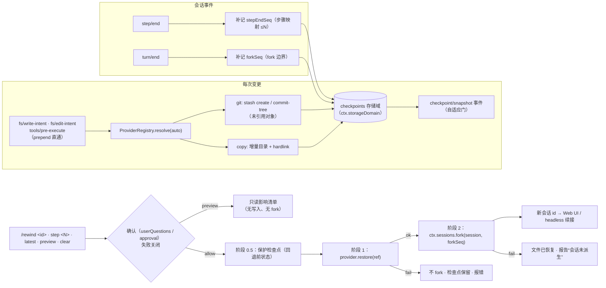

# dsh-checkpoint-rewind

[English](README.md) · **中文** · [Español](README.es.md) · [Português](README.pt.md) · [हिन्दी](README.hi.md)

**为 DeepSeek Harness 做对的 Claude Code `/rewind`。**

一个能力接缝插件，为 [DeepSeek Harness](https://github.com/deepseek-ai/deepseek-harness) 补上 **工作区文件快照 + 会话边界回退**：每次变更型工具执行前捕获工作区状态（git 优先、目录拷贝兜底），一条 `/rewind` 命令即可恢复文件**并**把会话 fork 回该检查点的轮次边界——模型上下文与磁盘文件永远一致。

[](LICENSE)
[](https://www.npmjs.com/package/dsh-checkpoint-rewind)
[](https://www.npmjs.com/package/dsh-checkpoint-rewind)
[](https://github.com/PerryLink/dsh-checkpoint-rewind/actions/workflows/ci.yml)
[](#)
[](#)

> **Topics**: `dsh` · `dsh-plugin` · `deepseek-harness` · `rewind` · `checkpoint` · `snapshot` · `session-fork` · `workspace-safety` · `undo` · `cordis-plugin`

**TL;DR**

- 📸 **每次变更前快照** —— 所有写入路径（`write`、`edit`、`str_replace_editor`、`bash`、`pwsh`、`terminal_send`……）经 `fs/*-intent` + `tools/pre-execute` 直通监听先行捕获，静默无感。
- 🧵 **git 优先、零历史风险** —— 快照是未引用的 git 对象（`stash create` / `commit-tree`）；恢复仅动工作树且只按显式路径，检查点之后新建的文件**绝不删除**。非 git 目录自动降级为增量目录快照。
- ⏪ **一条命令回退** —— `/rewind` 列出检查点；`/rewind <id 前缀>` / `step <N>` / `latest` 经确认后先恢复文件，再在检查点轮次边界 fork 会话并返回新会话 id。
- 🔍 **动手前先预览** —— `/rewind preview <target>` 打印精确影响（将被覆盖的文件、检查点后新建将保留的文件），不动任何东西——无确认提示、无写入、无 fork。
- 🛡️ **回退本身可撤销** —— 恢复前先捕获当前状态的保护检查点，`/rewind <guard-id>` 即可撤销这次回退。
- 🔒 **设计即失败关闭** —— 恢复必须经人工确认，无回答者即不恢复。绝不 `git reset --hard`、绝不 `git clean`、绝不编辑对话消息，绝不写入符号链接指向的位置。

---

## 为什么还需要一个 rewind 插件？

| 插件 | 卖点 | 恢复文件？ | 回退会话？ |
|---|---|---|---|
| **dsh-checkpoint-rewind**（本插件） | git 对象级快照 + 轮次边界 fork + 一键恢复 | ✅ 完整工作区状态 | ✅ fork 种子会话 |
| [Anionex/dsh-turn-rewind](https://github.com/Anionex/dsh-turn-rewind) | 持久 Change Ledger 逐变更增量 | ✅ 重放逆向增量 | ✅ 自有 ledger 模型 |
| [LingLambda/dsh-undo](https://github.com/LingLambda/dsh-undo) | 纯上下文回退到上一个已完成步骤 | ❌ | ✅ 仅上下文 |
| [Mongfayi/dsh-recall](https://github.com/Mongfayi/dsh-recall) | 消息撤回（删除该轮及之后一切） | ❌（明确不还原代码） | ✅ 删除轮次 |

一句话定位差异：**dsh-checkpoint-rewind 在每次变更前用无副作用的 git 原语捕获*工作区状态*，把"回到第 N 步"做成一条经确认的命令——先保护检查点、再恢复文件、后 fork 会话，每一步都有日志。** 没有会漂移的增量簿记，不做对话消息级编辑（那是另一个插件的范畴），不做跨设备同步。

## 特性

- **每次变更前快照** —— 在 `fs/write-intent` / `fs/edit-intent` 与 `tools/pre-execute`（非 fs 变更工具如 `bash`、`pwsh`、`terminal_send`）上以 prepend 直通监听，覆盖所有变更路径，同时不抢占策略决策槽。
- **Provider seam** —— `git` 优先：`git stash create` / `git commit-tree` 产生未引用的快照对象，**绝不触碰工作树、索引与历史**；恢复只用 worktree-only 且**显式路径**的 `git restore`（`git restore … -- .` 会删除检查点之后 `git add` 的新文件，provider 绝不发出该形式）。无初始提交（unborn HEAD）的仓库被探测并自动降级 `copy`；可用性探测按工作区缓存。非 git 目录用 `copy`（增量目录快照 + hardlink 复用），并在列表中明确标注。
- **步骤级映射、轮次级 fork** —— 每个检查点记录其 turn/step；`step/end` 补记步骤映射（"回到第 N 步" = 最近的 ≤N 快照，经 `/rewind step <N>` 可达），`turn/end` 补记 fork 边界，使用 harness 真正的 `ctx.sessions.fork` 原语。
- **三段式回退事务** —— `/rewind <id>` 先经确认（userQuestions / approval seam，**无回答者失败关闭**），捕获当前状态的**保护检查点**（配置 `preRewindCheckpoint`），再恢复文件、最后 fork；恢复失败绝不 fork，fork 失败报告"文件已恢复、会话未派生"——而保护检查点让整个回退可撤销。
- **只读影响预览** —— `/rewind preview <target>`（同一寻址：id 前缀、`step <N>`、`latest`）精确显示一次恢复会覆盖哪些文件、哪些检查点之后新建的文件会保留，不经确认门、不写文件、不 fork——先知情再审批，而非盲跳。
- **持久注册表 + 配额** —— 检查点记录存 `ctx.storageDomain`（域 `checkpoints`；SQLite 后端 = 表行，JSON 后端 = 可读文件）；`maxSnapshots`（每会话，默认 50）与 `maxSnapshotBytes`（全局**增量字节**软配额，默认 512 MiB；每会话最新一条总是保留，大工作区不会被自我清理）、`pruneOnTurnEnd`，最旧优先。
- **copy 完整性选项** —— `verifyByHash` 让 copy provider 用内容哈希替代 size+mtime 快检（`touch -r` / `rsync -t` 精确还原 mtime 也无法掩盖同尺寸内容变更）并校验恢复内容；文件 mode 尽力恢复。
- **天然可重建** —— `/rewind` 输出走 harness 自有的 `command/run` + `command/done` 事件；`checkpoint/snapshot|bound|prune|rewind` 会话事件在宿主收录类型**或**支持 `ignorable` 信封时自动追加（运行时探测；rc.6 自适应门保持关闭且安全）。
- **Web 就绪的投影** —— 只要 `ctx.sessionProjections` 存在即经 `ctx.inject` 注册投影单元 `checkpoints`，shell 面板可直接从事件日志渲染检查点条，插件无需任何改动。
- **模型感知的回退** —— fork 子会话收到注入通知（`user/message`，plugin source），写明恢复到的检查点、恢复范围与保护检查点，续接的模型不会沿用过期工具结果。

## 兼容性

| 要求 | 状态 | 最后验证 |
|---|---|---|
| DeepSeek Harness `0.1.0-rc.6`（npm `next`） | ✅ 加载级已验证 | 2026-08-14（tarball 安装后 `dsh --profile headless --dump-config` 出现插件层；headless 运行仅止于凭据阶段） |
| Node `^22.19 \|\| >=24` | ✅ CI 矩阵 | 2026-08-14 |
| `git` | 可选 | 仅 git provider 需要；非 git 目录与 unborn HEAD 仓库自动降级 copy |

## 快速开始

`dsh-checkpoint-rewind` 以 **bundle 插件**形式发布——发布包即源码（`index.mjs` + `lib/`，纯 ESM），因此没有构建步骤、没有 `src/` 目录；`package.json` 的 `dsh.bundle.patch` 指向根目录 `cordis.patch.yml`。

```sh
dsh plugin --profile <profile> add dsh-checkpoint-rewind    # 标准 Profile Bundle 安装（npm）
# 重启 dsh —— /rewind 即在 Web UI 生效
```

或直接挂载试验：

```sh
pnpm dsh web --patch ./cordis.patch.yml
```

卸载（移除命令与监听；快照文件保留至你手动删除）：

```sh
dsh plugin --profile <name> remove dsh-checkpoint-rewind
rm -rf "$DSH_HOME/dsh-checkpoint-rewind"   # copy provider 快照；git 对象由 gc 回收
```

工作区一旦发生变更，检查点自动生成。在 Web UI（或任何交互式适配器）中：

```text
/rewind
```

```text
rewind: 3 checkpoints (newest last):
#a1b2c3d4 · (git) · turn 2 step 1 · 2026-08-14 12:00:01 (3 min ago) · trigger: bash · 4 files · 1.2 MiB · fork: ready
#b2c3d4e5 · (git) · turn 2 step 3 · 2026-08-14 12:00:41 · trigger: str_replace_editor · 2 files · 310 KiB · fork: ready
#c3d4e5f6 · (copy) · turn 3 step 1 · 2026-08-14 12:01:10 · trigger: write · 1 file · 90 KiB · fork: pending (turn not closed)
run "/rewind <id>" to restore files and fork the session from that checkpoint
```

按唯一 id 前缀（列表里的短 id 即可）、步号或 `latest` 寻址：

```text
/rewind b2c3d4e5
/rewind step 2
/rewind latest
/rewind preview b2c3d4e5   # 只读：显示哪些文件会变，不触碰任何东西
/rewind clear        # 经确认删除本会话全部检查点（文件不动）
```

`preview` 走同一套寻址（`<id 前缀>`、`step <N>`、`latest`），无需确认、不写任何东西即可打印影响：

```text
rewind preview: 检查点 #b2c3d4e5-… (provider git, turn 2 step 3)
恢复它会覆盖 2 个文件：
  src/app.ts
  src/util.ts
3 个文件已与检查点一致（不触碰）。
不删除任何文件：检查点之后新建的 1 个文件将保留：
  src/new.ts
运行 "/rewind <id>" 确认并应用（先捕获一个保护检查点）
```

插件询问 **"Restore the workspace files to this checkpoint and fork the session?"** → 批准后先捕获保护检查点、恢复文件、在该检查点的轮次边界 fork 会话，并返回新会话 id：

```text
rewind: restored 2 file(s) from checkpoint b2c3d4e5-… (provider git)
and forked a new session at seq 87 (end of turn 2).
session: session-123
Open the new session to continue from before that turn; this session keeps its later history.
rewind guard: f6a7b8c9-… (run "/rewind f6a7b8c9" to undo this rewind)
```

headless 运行打印同样的结果并附带续接指引；Web shell 可用返回的 `session:` id 完成跳转（见 [Web UI 锚点](#web-ui-锚点)）。

## 演示

一次真实的组装式 headless 运行（`npm run test:integration`）：agent 在第 1 轮改 `a.txt`、第 2 轮改 `b.txt`，随后新建 `c.txt`，一条 `/rewind preview` 只读查看影响面，再一条 `/rewind` 恢复两个文件并 fork 会话（下方为逐字转录；注意增量记账：第二个检查点只计变更文件——preview 行不触发确认、不写任何东西）。

```console
[rewind-integration] copy flow: mounted; workspace C:\Users\me\Temp\dsh-rewind-int-ws-NTk6jw
[rewind-integration]   /rewind list:
    rewind: 2 checkpoints (newest last):
    #9ab2d753 · (copy) · turn 1 step 1 · 2026/8/15 12:57:05 (just now) · trigger: fs/write-intent · 2 files · 10 B · fork: ready
    #7ec0e96f · (copy) · turn 2 step 1 · 2026/8/15 12:57:05 (just now) · trigger: fs/write-intent · 2 files · 6 B · fork: ready
    run "/rewind <id>" to restore files and fork the session from that checkpoint
[rewind-integration]   /rewind preview ok (no gate, no writes): rewind preview: checkpoint #9ab2d753-… (provider copy, turn 1 step 1)
[rewind-integration]   [user-questions] asked: Restore the workspace files to this checkpoint and fork the session?
[rewind-integration]   /rewind result: rewind: restored 2 file(s) from checkpoint 9ab2d753-… (provider copy)
and forked a new session at seq 3 (end of turn 1).
session: session-1
Open the new session to continue from before that turn; this session keeps its later history.
1 file(s) created after the checkpoint were left in place (overwrite rollback never deletes files)
rewind guard: f18027ea-… (run "/rewind f18027ea" to undo this rewind)
[rewind-integration]   fork ok: child session-1 seedLength 4 parent integration-session
[rewind-integration] copy flow: PASS
[rewind-integration] git flow: mounted; workspace C:\Users\me\Temp\dsh-rewind-int-git-CXd4BQ
[rewind-integration]   /rewind preview ok (git): rewind preview: checkpoint #fd1dc3ad-… (provider git, turn 1 step 1)
[rewind-integration]   [user-questions] asked: Restore the workspace files to this checkpoint and fork the session?
[rewind-integration]   git restore ok; HEAD intact: 19484e99
[rewind-integration] git flow: PASS
[rewind-integration] integration: ALL PASS
```

## 配置

全部为 `Config` 字段（cordis.yml 可改；无硬编码）：

| 键 | 默认值 | 含义 |
|---|---:|---|
| `enabled` | `true` | 总开关；`false` 时命令、监听、provider 全部消失。 |
| `provider` | `auto` | 快照 provider：`auto`（git 可用则 git，否则 copy）· `git`（非 git 目录响亮失败）· `copy`。 |
| `gitBin` | `git` | git 可执行路径。 |
| `snapshotDir` | `$DSH_HOME/dsh-checkpoint-rewind` | copy provider 快照根目录。 |
| `maxSnapshots` | `50` | **每会话**保留的检查点数（最旧优先清理）。 |
| `maxSnapshotBytes` | `536870912`（512 MiB） | 跨会话全局**增量字节**软配额（最旧优先清理；每会话最新一条总是保留）。 |
| `pruneOnTurnEnd` | `true` | 轮次结束时执行配额清理。 |
| `mutationTools` | `['bash','write','edit','str_replace_editor','pwsh','terminal_send']` | `tools/pre-execute` 上视为变更型的工具名（fs 工具已由 `fs/*-intent` 覆盖）。 |
| `excludeGlobs` | `['node_modules','.git','.dsh','dist','build']` | copy provider 跳过的 glob 模式：`*` 匹配段内任意字符、`?` 匹配单字符、`**` 跨任意段；无 `/` 的模式匹配任意深度的段名，含 `/` 的模式按相对路径匹配，命中目录则整个子树排除（`.git` 与快照目录恒被排除）。 |
| `confirmVia` | `auto` | 确认通道：`auto`（优先 userQuestions，其次 approval）· `userQuestions` · `approval`。注意：`approval` 要求开放轮次而命令运行于轮次之间，rc.6 上会失败关闭并给出可操作提示——请挂载 userQuestions。 |
| `listLimit` | `10` | `/rewind` 无参列出的检查点数。 |
| `preRewindCheckpoint` | `warn` | 恢复前的保护检查点：`warn`（捕获失败仅警告继续）· `require`（中止回退）· `off`。 |
| `verifyByHash` | `false` | copy provider 内容哈希比对与恢复校验（更慢；堵住 size+mtime 快检盲区）。 |

```yaml
- insert:
    - id: checkpoint-rewind
      name: dsh-checkpoint-rewind
      config:
        provider: auto
        maxSnapshots: 50
        maxSnapshotBytes: 536870912
        pruneOnTurnEnd: true
        confirmVia: auto
        preRewindCheckpoint: warn
```

## 安全模型

- **git 历史不可触碰。** git provider 只运行白名单内的无副作用原语——`stash create`、`commit-tree`、`restore --worktree`、`ls-tree`、`diff-tree`、`ls-files`、`status`、`rev-parse`——由运行时断言强制，且对象引用在传给 git 前会校验为十六进制 id（被篡改的记录无法注入 git 选项）。**绝不 `reset --hard`、绝不 `clean`、绝不改写索引或历史。**
- **覆盖式回滚，绝不删除。** 恢复只覆盖捕获的文件，且 git provider 按**显式路径**恢复（`git restore … -- .` 会删除检查点之后 `git add` 的新文件）。快照之后新建的文件（未跟踪**或**已暂存）只*报告*而绝不删除。
- **绝不写入链接指向的位置，绝不路径穿越。** copy provider 在把引用拼入快照目录路径前校验其格式，恢复时拒绝经已变为符号链接的目标（或其祖先目录）写入，也拒绝读取已变为符号链接的快照存储文件——恢复绝不跟随链接进出工作区。快照引用与 git 对象 id 在持久边界做格式校验。
- **恢复必须先确认。** 覆盖用户文件必经确认 seam（ask 语义）；回答者缺失、抛错或拒绝一律**失败关闭**。`/rewind preview` 是先以只读方式查看影响面的途径。
- **回退可撤销。** 恢复前先捕获当前状态的保护检查点，恢复该保护检查点即撤销回退。`preRewindCheckpoint: require` 在保护检查点无法捕获时中止回退。
- **三段式事务，顺序固定。** 先保护检查点、再文件、后 fork，每阶段落日志；恢复失败时文件、检查点与会话原样保留。
- **模型可见 ⟺ 已落盘。** 用户/模型看到的一切均可从会话日志（`command/run` + `command/done`，宿主收录后还有 `checkpoint/*` 事件）加持久 `checkpoints` 域重建。

## 工作原理

`checkpoint/snapshot`（创建）→ `checkpoint/bound`（step/end 与 turn/end 补记）→ `/rewind`（列出 / 确认 / 保护 / 恢复 / fork）：



完整决策记录、事件词汇与 provider 契约见 [ARCHITECTURE.md](ARCHITECTURE.md)。

## 会话事件（rc.6 说明）

插件把 `checkpoint/snapshot`、`checkpoint/bound`、`checkpoint/prune`、`checkpoint/rewind` 声明为 log-only 的 `SessionEventMap` 成员。harness rc.6 **没有插件事件注册面**，且 `Session.append` 静默丢弃未知选项键，直接 append 会让会话重载时被持久化层拒绝。因此插件经**自适应门** append：运行时探测（在绝不接入持久化的独立 session store 上）判断宿主的 `append` 是否盖章 `ignorable` 信封——rc.6 上门保持关闭；支持信封的宿主上 `checkpoint/*` 事件自动以 `ignorable: true` 落盘。在此之前，权威审计链是宿主已知的 `command/run` + `command/done` 事件加持久 `checkpoints` 存储域。

## Web UI 锚点

插件已在命令结果中返回新会话 id（`session: <id>`），Web shell 可据此跳转。**会话投影单元 `checkpoints` 已随插件交付**：只要 `ctx.sessionProjections` 存在即经 `ctx.inject` 注册（折叠 `checkpoint/snapshot|bound|prune|rewind` 为全量列表值，`stateVersion` 0）——rc.6 宿主上恒为空列表，宿主构建携带 `checkpoint/*` 词汇或 `ignorable` 信封后无需改插件即自动填充。留给 shell 的跟进只剩**只读面板**的渲染（见 [ARCHITECTURE.md](ARCHITECTURE.md#todo-web-ui-checkpoint-strip)）。

## FAQ

**它能替代 git 吗？** 不能——它*使用* git。git 仓库里得到字节级精确、去重的快照对象且不动历史；任何其他目录由 copy provider 用普通文件做到同样效果。常规提交仍是你长期的历史。

**为什么不用 `git reset --hard`？** 因为毁掉状态不是安全网该干的事。插件只创建未引用对象并做 worktree-only、显式路径的恢复，坏回退永远不会丢失历史、索引或检查点之后新建的文件。

**能回到一轮中间的某个步骤吗？** 文件恢复是步骤级精确的（`/rewind step <N>` = 最近的 ≤N 快照）。会话 fork 则遵循 harness 的 fork 粒度：子会话止于该检查点的 `turn/end`，因为 `ctx.sessions.fork` 拒绝开放轮次内的前缀。文件与会话在该边界保持一致。

**没人能回答确认时会怎样？** 什么都不动——插件失败关闭（`unavailable`/`rejected`），保留检查点并返回解释性错误。rc.6 上 `confirmVia: approval` 会提示挂载 userQuestions，因为 approval 要求开放轮次而命令运行于轮次之间。

**能撤销一次回退吗？** 能——每次获批的回退都先捕获回退前状态的保护检查点，结果里打印 `rewind guard: <id>`，`/rewind <guard-id>` 即可恢复该状态。

**如何寻址检查点？** 唯一 id 前缀（列表中的 8 位短 id 即可）、`/rewind step <N>`、`/rewind latest`，或 `/rewind clear` 删除本会话全部检查点（文件不动）。

**`preview` 做什么——又不做什么？** 它解析检查点后做只读比较：哪些文件将被覆盖（或重建）、哪些已一致、哪些检查点之后新建的文件将保留。它绝不提示、绝不写入、绝不 fork，也不记录 `checkpoint/rewind` 事件——确认门只在真正的 `/rewind <id>` 上运行。

## 测试

```sh
npm install
npm test                 # 160 个单测（test/**/*.test.mjs，含 provider 套件）：快照创建/去重/并发、
                         # git 与非 git 路径、unborn HEAD 降级、增量字节配额 + 最新保留下限、已暂存
                         # 新文件恢复安全、≤N 边界映射、三段式恢复失败矩阵、approval 拒绝、寻址
                         # （前缀/step/latest/preview/clear）、保护检查点三种模式、自适应事件门 +
                         # ignorable 探测、哈希校验、glob 排除语义、符号链接/引用路径安全加固、
                         # checkpoints 投影单元（真 Cordis + 真 SessionStore/CommandRuntime/
                         # SessionProjectionRegistry）
npm run test:integration # 组装式 headless 验证：agent 跨两轮改 2 个文件 → /rewind 列表 → preview
                         # （不经确认门、不写文件）→ 回退 → 断言文件内容、fork 上下文、保护检查点
                         # 与检查点后新建文件保留
```

## 故障排查

| 症状 | 原因 / 处理 |
|---|---|
| `/rewind <id>` 返回 `rewind cancelled: no confirmation answerer` | 没有挂载 userQuestions/approval 通道——插件失败关闭。在 Web UI 运行（或挂载提问提供方）；`confirmVia` 选择通道。 |
| `/rewind <id>` 返回 `approval requires an open turn …` | 命令运行于轮次之间而 approval 需要开放轮次——挂载 userQuestions 或 `confirmVia: userQuestions`。 |
| `rewind: checkpoint registry unavailable` | `checkpoints` 存储域打开失败（存储后端缺失/报错）。检查 harness 日志与存储域后端路由配置。 |
| 检查点显示 `fork: pending (turn not closed)` | 其轮次尚无 `turn/end`；文件仍可恢复，会话 fork 需等轮次闭合。 |
| `files restored … but the session was NOT forked` | 三段式事务第 2 阶段失败（无闭合边界或 fork 被拒）。文件保持已恢复；用结果里的 `rewind guard: <id>` 撤销——具体原因见结果文本。 |
| `rewind: aborted — the pre-rewind guard checkpoint could not be captured` | `preRewindCheckpoint: require` 因保护检查点捕获失败拒绝执行；修复存储（或改 `warn`/`off`）。 |
| 目录是 git 仓库但检查点标注 `(copy)` | unborn HEAD（尚无初始提交）：git 快照原语依赖 HEAD，插件自动降级 copy 直至首次提交。 |
| headless 运行报 `MISSING_CREDENTIAL` | 与本插件无关：未配置 `DEEPSEEK_API_KEY`。 |
| 快照占用增长 | 每次快照后与 `turn/end` 时自动清理（`pruneOnTurnEnd`）；调低 `maxSnapshots`/`maxSnapshotBytes`，或 `/rewind clear`，或卸载后删除 `$DSH_HOME/dsh-checkpoint-rewind`。 |

## 权限与数据

| 资源 | 访问 |
|---|---|
| 工作区文件 | 快照只读；仅在获批的 `/rewind <id>` 恢复时写入（覆盖式，绝不删除） |
| 快照存储 | 只写 `snapshotDir`（默认 `$DSH_HOME/dsh-checkpoint-rewind/`） |
| Git 仓库 | 仅白名单无副作用原语（`stash create`、`commit-tree`、显式路径 `restore --worktree`……）——绝不 `reset --hard`/`clean` |
| 会话日志 | 读取轮次/步骤边界；宿主收录类型或支持 `ignorable` 信封时追加 log-only 的 `checkpoint/*` 事件 |
| 网络 / 凭据 | 无——完全本地 |

## 贡献者

感谢所有为本插件做出贡献的人：

- [PerryLink](https://github.com/PerryLink) —— 项目作者与维护者：插件架构、git/copy provider、三段式回退事务、五语文档、CI/CD 与 0.1.0 → 0.4.0 各版本发布。

还没有社区贡献者——你的第一个 PR 就有机会列在这里！入门见 [PR 模板](.github/PULL_REQUEST_TEMPLATE.md) 与 issue 模板。

## 许可证

Apache License 2.0 —— 见 [LICENSE](LICENSE)、[THIRD_PARTY_NOTICES.md](THIRD_PARTY_NOTICES.md) 与安全政策 [SECURITY.md](SECURITY.md)。

## 相关插件

- **dsh-memento** —— 有界、带审批门的跨会话记忆（同一插件族约定）。
- [Anionex/dsh-turn-rewind](https://github.com/Anionex/dsh-turn-rewind) · [LingLambda/dsh-undo](https://github.com/LingLambda/dsh-undo) —— 本插件差异化定位的对照物（见上表）。
